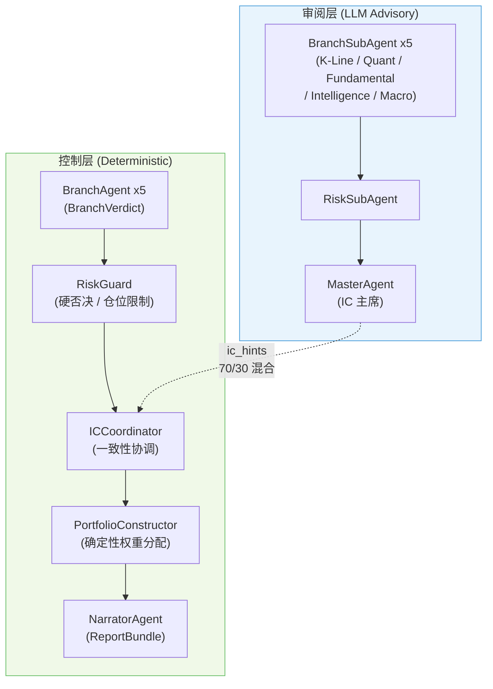

<div align="center">

# Quant-Investor

**Dual-Layer Multi-Agent Quantitative Investment Research Platform**

双层多智能体量化投研系统 | A 股 & 美股 | LLM 辩论框架 | 因子分析 | 风险管理 | 回测引擎

<br/>


</div>

---

系统采用**双层智能体架构**：确定性控制层负责硬约束、风控否决与组合构建，LLM 审阅层提供定性评判与结构化辩论。审阅层严格为 advisory-only，永远不覆盖控制层的硬否决。覆盖 A 股与美股市场，完整支持从基本面分析到投资报告生成的全流程管道。

---

## 入口

| 方式 | 用法 |
|------|------|
| **Python API** | `from quant_investor import QuantInvestor` |
| **CLI** | `quant-investor research run` |
| **Web UI** | `quant-investor web` |

---

## 架构



**分支权重**

| 分支 | Quant | K-Line | Intelligence | Fundamental | Macro |
|------|:-----:|:------:|:----------:|:-----------:|:-----:|
| 权重 | 28% | 22% | 20% | 15% | 15% |

---

## 核心特性

### 多智能体辩论

多个 LLM 对同一标的展开结构化辩论，输出 `DebateVerdict` 与置信度校准信号。支持 OpenAI、Anthropic Claude、DeepSeek、Google Gemini 等多家提供方，无 API Key 时自动降级为纯算法模式。

### 全流程研究管道

基本面 → 量化因子 → 风险评估 → 投资组合构建，结果统一封装为 `ResearchPipelineResult`，由 NarratorAgent 渲染为结构化 Markdown 报告。

### 因子库

Alpha158、技术指标、基本面因子、宏观替代因子，支持遗传算法因子挖矿与因子衰减分析。

### 风险管理

VaR / CVaR、压力测试、因子风险模型、市场冲击估算。RiskGuard 拥有硬否决权，可强制限制仓位暴露。

### 回测引擎

Walk-forward 验证，支持 A 股与美股历史数据回测。

### 宏观终端

实时拉取 Tushare / FRED / AkShare 宏观指标，输出风险雷达。

### 研究工作台

`quant-investor web` 提供 FastAPI 后端 (`/api`) 和 React 前端，包含研究、历史记录、设置等完整工作区。

---

## 技术栈

| 层级 | 技术 |
|------|------|
| **后端框架** | Python 3.10+, FastAPI, Pydantic v2, uvicorn |
| **前端框架** | React 19, TypeScript 5.9, Vite 8, TailwindCSS 4 |
| **状态管理** | Zustand 5, TanStack Query v5, TanStack Table v8 |
| **数据科学** | pandas, NumPy, scikit-learn, XGBoost, TA-Lib |
| **可视化** | Recharts 3, Lightweight Charts, Plotly, Matplotlib |
| **数据源** | Tushare (A 股), yfinance (美股), FRED (宏观), Finnhub |
| **LLM 提供方** | OpenAI, Anthropic Claude, DeepSeek, Google Gemini |
| **构建与部署** | Hatch (Python), Vite (前端), Docker Compose |

---

## 快速开始

### 安装

```bash
pip install -e ".[dev]"
```

<details open>
<summary><strong>Python API</strong></summary>

```python
from quant_investor import QuantInvestor

investor = QuantInvestor(
    stock_pool=["000001.SZ", "600519.SH"],
    market="CN",
    total_capital=1_000_000,
    risk_level="中等",
    verbose=True,
)

result = investor.run()
print(result.report_bundle)
```

</details>

<details>
<summary><strong>CLI</strong></summary>

```bash
quant-investor research run \
  --stocks 000001.SZ 600519.SH \
  --market CN \
  --capital 1000000 \
  --risk 中等
```

</details>

<details>
<summary><strong>Web 工作台</strong></summary>

```bash
# 默认运行方式：同源提供 /api 与 workspace 前端
quant-investor web --reload

# 前端开发模式：单独启动 Vite，并将 /api 代理到后端
./run_web.sh
```

默认网页入口跳转到 `/research`，公开路由为 `/research`、`/history`、`/history/:jobId`、`/settings`。前端位于 `frontend/`，开发模式下通过 Vite 将 `/api` 代理到后端。

</details>

---

<details>
<summary><strong>环境变量</strong></summary>

复制 `.env.example` 并填写：

```bash
cp .env.example .env
```

| 变量 | 说明 |
|------|------|
| `TUSHARE_TOKEN` | Tushare Pro Token（A 股数据） |
| `FRED_API_KEY` | FRED 宏观数据 API Key |
| `FINNHUB_API_KEY` | Finnhub 美股数据 API Key |
| `OPENAI_API_KEY` | OpenAI（LLM 辩论引擎） |
| `ANTHROPIC_API_KEY` | Anthropic Claude（LLM 辩论引擎） |

</details>

<details>
<summary><strong>项目结构</strong></summary>

```text
myQuant/
├── quant_investor/              # 核心引擎
│   ├── pipeline/                # QuantInvestor 主管道
│   ├── agents/                  # 双层智能体框架
│   │   ├── subagents/           #   LLM 审阅层 (5 BranchSubAgent)
│   │   ├── master_agent.py      #   IC 主席 (MasterAgent)
│   │   ├── orchestrator.py      #   三阶段异步编排
│   │   ├── risk_guard.py        #   硬否决风控引擎
│   │   └── ic_coordinator.py    #   一致性协调
│   ├── cli/                     # CLI 入口
│   ├── data/                    # 数据获取与管理
│   ├── market/                  # A 股 / 美股市场适配
│   ├── reporting/               # NarratorAgent -> ReportBundle
│   └── monitoring/              # 系统监控与告警
├── web/                         # FastAPI 后端 API
├── frontend/                    # React 19 / Vite / TailwindCSS
├── tests/                       # 单元与集成测试
├── scripts/                     # 工具脚本
├── data/                        # 本地数据目录（git 忽略）
└── results/                     # 本地输出目录（git 忽略）
```

</details>

<details>
<summary><strong>协议与契约</strong></summary>

| 术语 | 说明 |
|------|------|
| `branch review` | 当前公开研究流程规范名 |
| `NarratorAgent -> ReportBundle` | 当前报告协议 |
| `buy` / `hold` / `sell` / `watch` / `avoid` | 当前稳定动作标签 |
| `reject` / `light_buy` / `strong_buy` | 已移除的旧标签，不再作为公开动作标签 |

</details>

---

## 开发

```bash
# 安装开发依赖
pip install -e ".[dev]"

# 全部测试
pytest tests/ -v

# 单元测试
pytest tests/unit/ -v

# 集成测试
pytest tests/integration/ -v
```

---

## 文档

详细文档位于 `docs/` 目录：

- [Documentation Index](docs/README.md)
- [Entrypoints and Versioning](docs/architecture/entrypoints_and_versioning.md)
- [Research Pipeline and Protocols](docs/architecture/research_pipeline_and_protocols.md)
- [Module Map](docs/modules/module_map.md)

---

## 许可证

本项目基于 [MIT License](LICENSE) 开源。
