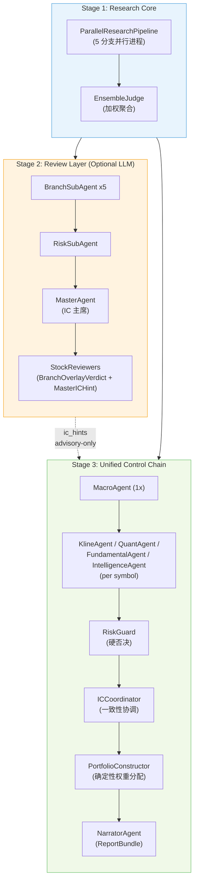

<div align="center">

# Quant-Investor

**Three-Layer Multi-Agent Quantitative Investment Research Platform**

三层多智能体量化投研系统 | A 股 & 美股 | LLM 辩论框架 | 因子分析 | 风险管理 | 回测引擎

<br/>


</div>

---

围绕 `QuantInvestor` 单一主线，系统采用**三层数据架构**：`GlobalContext`（市场全局上下文）→ `SymbolResearchPacket`（逐标的多分支研究）→ `PortfolioDecision`（组合决策与执行）。确定性控制层负责硬约束、风控否决与组合构建，LLM 审阅层提供定性评判与结构化辩论，严格为 advisory-only，永远不覆盖控制层的硬否决。覆盖 A 股与美股市场，完整支持从基本面分析到投资报告生成的全流程管道。

---

## 入口

| 方式 | 用法 |
|------|------|
| **Python API** | `from quant_investor import QuantInvestor` |
| **CLI** | `quant-investor research run` |
| **Web UI** | `quant-investor web` |

---

## 架构



**分支权重**

| 分支 | Quant | K-Line | Intelligence | Fundamental | Macro |
|------|:-----:|:------:|:----------:|:-----------:|:-----:|
| 权重 | 28% | 22% | 20% | 15% | 15% |

---

## 核心特性

### 单一主线

仓库主入口只公开 `QuantInvestor` 与 `QuantInvestorPipelineResult`；其余契约类型作为稳定数据模型导出供研究与测试复用。

### 三层协议

`GlobalContext` → `SymbolResearchPacket` → `PortfolioDecision` 三层协议贯穿数据采集、分支研究、组合决策全流程，所有中间产物均为结构化 dataclass，可序列化、可追溯。

### 结构化 Review Layer

多分支审阅结果进入确定性控制链（Research Agents → RiskGuard → ICCoordinator → PortfolioConstructor → NarratorAgent），审阅层只提供 advisory 信号。`StockReviewers` 在 symbol 级别产出 `BranchOverlayVerdict` 与 `MasterICHint`，受 score/confidence delta cap 约束。模型角色支持 primary/fallback 双链解析（默认 deepseek-reasoner / gpt-5.4），支持 OpenAI、Anthropic Claude、DeepSeek、Google Gemini、通义千问、Kimi 等多家提供方，无 API Key 时自动降级为纯算法模式。每次 LLM 调用写入 `data/llm_usage.jsonl`，session 级别汇总 token 用量与成本估算。

### 全流程研究管道

基本面 → 量化因子 → 风险评估 → 投资组合构建，结果统一封装为 `QuantInvestorPipelineResult`，由 NarratorAgent 渲染为结构化 Markdown 报告。

### 因子库

Alpha158、技术指标、基本面因子、宏观替代因子，支持遗传算法因子挖矿与因子衰减分析。

### 风险管理

VaR / CVaR、压力测试、因子风险模型、市场冲击估算。RiskGuard 拥有硬否决权，可强制限制仓位暴露。

### 回测引擎

Walk-forward 验证，支持 A 股与美股历史数据回测。

### 宏观终端

实时拉取 Tushare / FRED / AkShare 宏观指标，输出风险雷达（A 股：杠杆情绪、GDP、估值、通胀、贸易汇率、财政；美股：货币政策、增长、估值、通胀、情绪与收益率曲线）。

### 研究工作台

`quant-investor web` 提供 `web.main:app` 工作台后端入口与 React/Vite 前端；`./run_web.sh` 可启动前端开发工作流。

---

## 技术栈

| 层级 | 技术 |
|------|------|
| **后端框架** | Python 3.10+, FastAPI, Pydantic v2, uvicorn |
| **前端框架** | React 19, TypeScript, Vite, TailwindCSS |
| **状态管理** | Zustand 5, TanStack Query v5, TanStack Table v8 |
| **数据科学** | pandas, NumPy, SciPy, scikit-learn, XGBoost, TA-Lib |
| **可视化** | Recharts 3, Lightweight Charts 5, Plotly, Matplotlib |
| **数据源** | Tushare (A 股), yfinance (美股), FRED (宏观), AkShare |
| **LLM 提供方** | OpenAI, Anthropic Claude, DeepSeek, Google Gemini, 通义千问, Kimi |
| **构建与部署** | Hatch (Python), Vite (前端), Docker Compose |

---

## 快速开始

### 安装

```bash
uv sync --extra dev
```

<details open>
<summary><strong>Python API</strong></summary>

```python
from quant_investor import QuantInvestor

investor = QuantInvestor(
    stock_pool=["000001.SZ", "600519.SH"],
    market="CN",
    total_capital=1_000_000,
    risk_level="中等",
    verbose=True,
)

result = investor.run()
print(result.report_bundle)
```

</details>

<details>
<summary><strong>CLI</strong></summary>

```bash
uv run quant-investor research run \
  --stocks 000001.SZ 600519.SH \
  --market CN \
  --capital 1000000 \
  --risk 中等
```

</details>

<details>
<summary><strong>Web 工作台</strong></summary>

```bash
# 默认运行方式：同源提供 /api 与 workspace 前端
uv run quant-investor web --reload

# 前端开发模式：单独启动 Vite，并将 /api 代理到后端
./run_web.sh
```

默认网页入口跳转到 `/research`，公开路由为 `/research`、`/history`、`/history/:jobId`、`/settings`。前端位于 `frontend/`，开发模式下通过 Vite 将 `/api` 代理到后端。

</details>

<details>
<summary><strong>每日定时分析</strong></summary>

```bash
# 编辑 daily_config.py 调整参数后运行
uv run python daily_runner.py
```

`daily_config.py` 支持配置市场、universe、资金、LLM 模型（agent / master + fallback）、reasoning 强度、超时、数据下载参数与定时调度时间。

</details>

---

<details>
<summary><strong>环境变量</strong></summary>

复制 `.env.example` 并填写：

```bash
cp .env.example .env
```

| 变量 | 说明 |
|------|------|
| `TUSHARE_TOKEN` | Tushare Pro Token（A 股数据） |
| `TUSHARE_URL` | Tushare 代理 URL（可选） |
| `KIMI_API_KEY` | Kimi / Moonshot（LLM Review Layer） |
| `DEEPSEEK_API_KEY` | DeepSeek（LLM Review Layer） |
| `DASHSCOPE_API_KEY` | 通义千问（LLM Review Layer） |
| `FRED_API_KEY` | FRED 宏观数据 |
| `FINNHUB_API_KEY` | Finnhub（可选） |
| `DB_PATH` | 股票数据库路径 |
| `APP_DB_PATH` | legacy web session DB 路径 |
| `API_HOST` / `API_PORT` | web 服务监听地址 |
| `CORS_ORIGINS` | workspace 开发时允许的前端来源 |

</details>

<details>
<summary><strong>项目结构</strong></summary>

```text
myQuant/
├── quant_investor/              # 核心引擎
│   ├── pipeline/                # QuantInvestor 主管道
│   │   ├── mainline.py          #   单一主线入口 (QuantInvestor)
│   │   └── parallel_research_pipeline.py  #   5 分支并行研究核心
│   ├── agent_protocol.py        # 三层协议定义 (GlobalContext / SymbolResearchPacket / PortfolioDecision)
│   ├── agent_orchestrator.py    # 统一控制链编排 (AgentOrchestrator)
│   ├── agents/                  # 结构化 agent 体系
│   │   ├── kline_agent.py       #   K-Line 技术分析 agent
│   │   ├── quant_agent.py       #   量化因子 agent
│   │   ├── fundamental_agent.py #   基本面 agent
│   │   ├── intelligence_agent.py#   情报 agent
│   │   ├── macro_agent.py       #   宏观 agent
│   │   ├── risk_guard.py        #   硬否决风控引擎
│   │   ├── ic_coordinator.py    #   一致性协调
│   │   ├── portfolio_constructor.py  #   确定性权重分配
│   │   ├── narrator_agent.py    #   NarratorAgent → ReportBundle
│   │   ├── master_agent.py      #   IC 主席 (MasterAgent)
│   │   ├── orchestrator.py      #   Review Layer 异步编排
│   │   ├── stock_reviewers.py   #   symbol-level LLM review (BranchOverlayVerdict + MasterICHint)
│   │   └── subagents/           #   LLM 审阅层 (5 BranchSubAgent + RiskSubAgent)
│   ├── model_roles.py           # 模型角色解析 (primary / fallback)
│   ├── llm_gateway.py           # 统一 LLM 网关与用量观测
│   ├── llm_transport.py         # OpenAI-compatible 传输抽象
│   ├── branch_contracts.py      # 公开数据契约 (Pydantic 模型)
│   ├── kline_backends/          # K-Line 预测后端
│   │   ├── heuristic.py         #   统计基线后端
│   │   ├── kronos_adapter.py    #   Kronos 时序 Transformer
│   │   ├── chronos_adapter.py   #   Amazon Chronos 基础模型
│   │   ├── hybrid_adapter.py    #   混合后端适配器
│   │   └── hybrid_engine.py     #   Kronos + Chronos 混合引擎
│   ├── market/                  # A 股 / 美股市场适配
│   │   ├── download_cn.py       #   A 股数据下载 (Tushare)
│   │   ├── download_us.py       #   美股数据下载 (yfinance)
│   │   ├── analyze.py           #   全市场分析编排
│   │   ├── run_pipeline.py      #   统一管道 (检查 → 下载 → 分析)
│   │   ├── cn_resolver.py       #   A 股 universe 解析
│   │   ├── cn_symbol_status.py  #   标的数据完整性评估
│   │   ├── dag_executor.py      #   三层 DAG 依赖图执行
│   │   ├── orchestration.py     #   市场编排层
│   │   └── shared_csv_reader.py #   共享 CSV 读取
│   ├── reporting/               # 报告生成
│   │   ├── conclusion_renderer.py  # Markdown 报告渲染
│   │   └── run_artifacts.py     #   ExecutionTrace / ModelRoleMetadata / WhatIfPlan
│   ├── cli/                     # CLI 入口
│   └── ...                      # 因子库、风险模型、回测、宏观终端等
├── web/                         # FastAPI 后端 API
├── frontend/                    # React 19 / Vite / TailwindCSS
├── daily_runner.py              # 每日定时分析入口
├── daily_config.py              # 每日分析参数配置
├── tests/                       # 单元与集成测试
├── docs/                        # 架构与模块文档
├── data/                        # 本地数据目录（git 忽略）
└── results/                     # 本地输出目录（git 忽略）
```

</details>

<details>
<summary><strong>协议与契约</strong></summary>

| 术语 | 说明 |
|------|------|
| `GlobalContext → SymbolResearchPacket → PortfolioDecision` | 三层数据协议 |
| `Research Core → Review Layer → Unified Control Chain` | 三阶段执行流水线 |
| `Research Agents → RiskGuard → ICCoordinator → PortfolioConstructor → NarratorAgent` | 统一控制链 |
| `NarratorAgent → ReportBundle` | 报告协议 |
| `StockReviewers → BranchOverlayVerdict + MasterICHint` | symbol-level LLM review 协议 |
| `buy` / `hold` / `sell` / `watch` / `avoid` | 稳定动作标签 |
| `reject` / `light_buy` / `strong_buy` | 已移除的旧标签 |

</details>

---

## 开发

```bash
# 安装开发依赖
pip install -e ".[dev]"

# 全部测试
pytest tests/ -v

# 单元测试
pytest tests/unit/ -v

# 集成测试
pytest tests/integration/ -v
```

---

## 文档

- [Entrypoints and Versioning](docs/architecture/entrypoints_and_versioning.md)
- [Research Pipeline and Protocols](docs/architecture/research_pipeline_and_protocols.md)
- [Module Map](docs/modules/module_map.md)
- [Macro Risk Reference](docs/modules/macro_risk_reference.md)

---

## 许可证

本项目基于 [MIT License](LICENSE) 开源。
