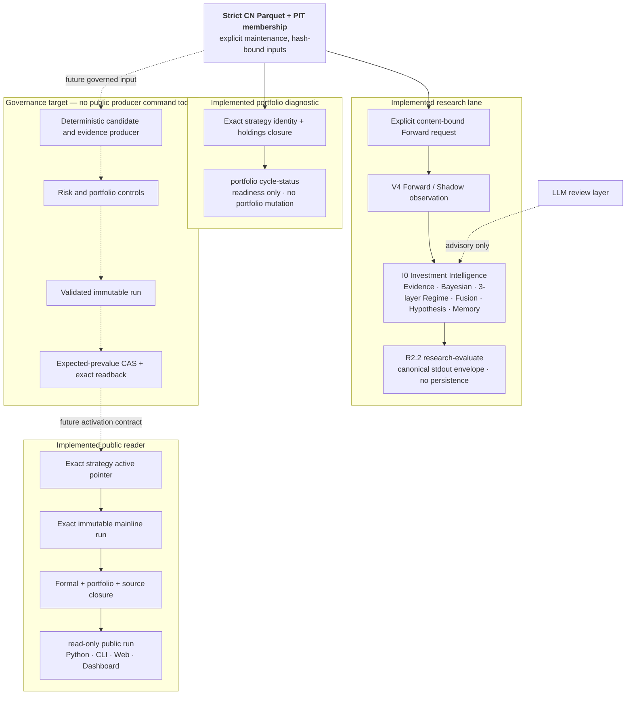

<div align="center">


**An A-share quantitative research and portfolio-decision system.**

*The hard part of quant is not producing a signal. It is knowing exactly what
the signal means, which evidence supports it, and when the system should stop.*

[](https://www.python.org)
[](pyproject.toml)
[](LICENSE)

**English** · [简体中文](README.zh-CN.md)

[Thesis](#the-thesis) · [Framework](#the-framework) · [How it runs](#how-it-runs) ·
[Problems it solves](#the-problems-it-solves) · [What is distinctive](#what-is-distinctive) ·
[Quick start](#quick-start) · [Current state](#current-state)

</div>

---

## What this is

Quant-Investor is a CN A-share research repository organized around one public
decision protocol, `myquant.v17.v4`. It combines strict point-in-time data,
factor research, forward evidence, investment-intelligence evaluation,
portfolio-readiness diagnostics and an exact active-pointer reader.

Those capabilities are deliberately separated. A research result is not an
active portfolio. A valid immutable run is not public until an exact strategy
pointer names it. A code merge is not operational activation. An LLM can
explain or challenge evidence, but it cannot choose a candidate, relax a risk
limit or change a weight.

The repository is useful today, but its boundaries matter: it can read and
validate an already activated V17 result, accumulate research-only Forward
evidence, evaluate exact I0/R2.2 requests and diagnose portfolio-input
readiness. It does not currently expose a public decision-run producer,
production publisher, activation command, broker connection, order path or
trade executor.

## The thesis

Most quantitative systems do not fail with a dramatic exception. They fail by
quietly returning something plausible:

| Failure | What it looks like from inside |
|---|---|
| **Evidence that does not survive its own window** | A factor looks significant on overlapping forward labels, then disappears on a non-overlapping or longer evaluation. |
| **Data that substitutes itself** | A missing Parquet partition becomes CSV, a stale snapshot or an inferred value without changing the headline result. |
| **Definitions that move** | A factor depends on a mutable production set, so its recorded evidence no longer describes the factor now being used. |
| **Research mistaken for authority** | A Shadow observation, diagnostic score or model narrative is treated as though it were an active portfolio result. |
| **Language models inside the control path** | A generated explanation becomes a generated weight, leaving no deterministic answer to “why this position?”. |

The system's answer is simple:

> **Every public conclusion must resolve to exact evidence. If the required
> evidence or authority is missing, the system returns an explicit state and
> does not silently substitute another result.**

That principle explains the architecture better than a list of modules does.
Canonical data is content-bound. Research and activation live in separate
lanes. Public readers resolve one exact pointer. Invalid inputs remain visible
as blockers instead of being converted into optimistic defaults.

## The framework

The current repository has three implemented lanes and one clearly marked
governance target:


```mermaid
flowchart TD
    D["<b>Strict CN Parquet + PIT membership</b><br/>explicit maintenance, hash-bound inputs"]

    subgraph PR["Implemented public reader"]
        AP["Exact strategy active pointer"] --> MR["Exact immutable mainline run"]
        MR --> CL["Formal + portfolio + source closure"]
        CL --> PUB["read-only public run<br/>Python · CLI · Web · Dashboard"]
    end

    subgraph RR["Implemented research lane"]
        FR["Explicit content-bound Forward request"] --> SH["V4 Forward / Shadow observation"]
        SH --> I0["I0 Investment Intelligence<br/>Evidence · Bayesian · 3-layer Regime · Fusion · Hypothesis · Memory"]
        I0 --> R22["R2.2 research-evaluate<br/>canonical stdout envelope · no persistence"]
    end

    subgraph PD["Implemented portfolio diagnostic"]
        ID["Exact strategy identity + holdings closure"] --> CS["portfolio cycle-status<br/>readiness only · no portfolio mutation"]
    end

    subgraph GT["Governance target — no public producer command today"]
        TP["Deterministic candidate and evidence producer"] -.-> TC["Risk and portfolio controls"]
        TC -.-> TR["Validated immutable run"]
        TR -.-> TA["Expected-prevalue CAS + exact readback"]
    end

    D --> FR
    D --> ID
    D -. "future governed input" .-> TP
    TA -. "future activation contract" .-> AP
    LLM["LLM review layer"] -. "advisory only" .-> I0
```

The solid paths are callable or implemented today. The dotted producer path is
the required design for a future governed writer; it is not what `research
run`, `market analyze` or `market run` execute today.

### Data authority

Canonical market data is strict CN Parquet with point-in-time membership and
hash-bound manifests. Maintenance is an explicit workflow. An analysis or read
command never starts a provider call to patch a missing input behind the
operator's back, and CSV is not a hidden runtime substitute.

### Public authority

The public V17 surface is an exact reader:

```text
strategy active pointer
  -> immutable mainline run
  -> formal / portfolio / source closure
  -> myquant.v17.v4.mainline-public-run.v1
```

The reader does not build a decision run, scan for the newest artifact, choose
another protocol, borrow a Shadow result or create a bootstrap pointer. The
repository contains low-level immutable-write and compare-and-swap primitives,
but no public production publisher or activation CLI.

### Research intelligence

V4 Forward and Shadow collect future-only evidence from exact, content-bound
requests. I0 then provides deterministic Evidence records, Bayesian diagnostics,
three independent causal Regime layers, availability-aware branch Fusion,
falsifiable Hypotheses and immutable Memory values.

The Regime implementation has fixed Market, Industry and Theme state domains.
Each performs exactly one forward Markov filter step from explicit inputs. There
is no backward smoothing, hidden-history search, persistence writer, position
cap, risk overlay or portfolio mutation.

R2.2 replays one exact request and emits one canonical evaluation envelope to
stdout. It may propose a Memory suffix, but it does not write that proposal.
There is no V17 research-intelligence scheduler, daemon or automatic
paper-portfolio adapter in the current tree.

### Factor governance

Factor Governance v4 treats candidate generation, gate evidence, trial
correction, family-level multiplicity, maturity and portfolio increment as
different questions. Mining evidence remains research evidence until a
separate governed activation contract is satisfied.

Readiness is resolved from exact current artifacts. This README deliberately
does not freeze candidate counts, session counts or readiness values that can
become stale. The detailed mechanism and redesign are recorded in
[Factor mining mechanism](docs/factor_mining_mechanism.md).

### Portfolio readiness

`portfolio cycle-status` validates an explicitly supplied strategy identity and
holdings closure and produces a read-only readiness document. It does not
discover “current” holdings by directory order, create a portfolio, write a
paper ledger, activate a strategy or call a broker.

## How it runs

The repository exposes separate workflows with different authority.

### 1. Maintain canonical market data

```bash
quant-investor market maintain --market CN --staged
quant-investor market storage-validate --market CN
```

Provider access is separate and requires explicit operator authorization. A
successful storage validation proves the exact storage checks it ran; it does
not by itself create a current investment decision.

### 2. Read an active V17 result

These compatibility commands resolve the same strategy pointer and return the
same read-only authority chain:

```bash
quant-investor research run \
  --workspace-root /absolute/path/to/myQuant \
  --strategy-id <strategy-id>

quant-investor market analyze \
  --workspace-root /absolute/path/to/myQuant \
  --strategy-id <strategy-id>

quant-investor market run \
  --workspace-root /absolute/path/to/myQuant \
  --strategy-id <strategy-id>
```

Expected explicit states include:

| Condition | Result | Writes |
|---|---|---:|
| Active pointer absent | `V17_MAINLINE_UNINITIALIZED` | 0 |
| Pointer, run or closure invalid | `V17_MAINLINE_BLOCKED:<blocker>` | 0 |
| Market is not CN | `V17_MARKET_UNSUPPORTED` | 0 |
| Mainline backtest request | `V17_BACKTEST_UNAVAILABLE` | 0 |

These states describe what is missing or unsupported. They are not permission
to scan an older result or return a substitute.

### 3. Accumulate Forward / Shadow evidence

```bash
quant-investor-v17-v4 run-forward \
  --workspace-root /absolute/path/to/myQuant \
  --request-path data/private/v17_v4_runs/forward_requests/<request_id>.json \
  --request-sha256 <exact-byte-sha256>
```

A completed Shadow session remains research-only. It cannot advance the active
pointer or become the public portfolio result.

### 4. Evaluate matured research evidence

```bash
quant-investor-v17-v4 research-evaluate \
  --workspace-root /absolute/path/to/myQuant \
  --request-path data/private/research_intelligence/evaluation_requests/forward-evaluation-request-<sha256>.json \
  --request-sha256 <exact-byte-sha256>
```

The command is offline and stdout-only. It does not call a provider or model,
write a result, append Memory, change a Factor tier, choose a portfolio or touch
the active pointer.

### 5. Diagnose portfolio-cycle inputs

```bash
quant-investor portfolio cycle-status --help
```

The diagnostic requires explicit canonical paths, exact SHA-256 bindings and a
decision cutoff. A green foundation result means only that the supplied
identity and holdings evidence validated; the operational portfolio cycle may
still be incomplete.

## The problems it solves

| Classic failure | What this repository does about it |
|---|---|
| **Look-ahead and survivorship bias** | Point-in-time membership, explicit cutoffs and availability-aware evidence contracts. |
| **Silent data substitution** | Strict canonical Parquet, hash-bound manifests and no hidden CSV/latest-file fallback. |
| **Ambiguous public authority** | One exact strategy pointer names one immutable run and its transitive closure. |
| **Research presented as production** | Forward, Shadow, I0/R2.2, Factor diagnostics and public mainline authority are separate schema and storage families. |
| **Non-causal regime analysis** | Market, Industry and Theme each use one explicit forward Markov step with no backward smoothing or hidden history. |
| **Multiple testing and factor redundancy** | Trial correction, family-level multiplicity and incremental-value evidence are first-class Factor Governance concerns. |
| **Model output becoming a decision** | LLM output is advisory; deterministic controls remain the only acceptable source of candidates, limits and weights. |
| **Code rollout mistaken for activation** | Merge/deploy state and active-pointer state are checked and reported separately. |
| **Portfolio inputs inferred from old files** | Portfolio readiness accepts explicit identity and holdings references rather than newest-by-time discovery. |

## What is distinctive

**The repository says exactly what is implemented.** Public command names do
not imply that a producer ran. The reader, research evaluator, diagnostic
foundation and future governance target are described separately.

**Evidence carries identity.** Important artifacts bind protocol, strategy,
cutoff, source references and semantic hashes. A plausible number without its
closure is not promoted into a public conclusion.

**Missing evidence stays visible.** The system returns a named state or blocker
and performs no substitute write. This is more useful operationally than a
generic success/failure label because it identifies the missing authority.

**Research is allowed to be ambitious without acquiring operational power.**
Bayesian diagnostics, Markov Regime, branch Fusion, hypothesis generation and
Memory proposals can evolve while remaining unable to activate a portfolio.

**AI explains; deterministic contracts decide.** A model may summarize,
challenge or draft a hypothesis. It cannot alter the exact evidence closure,
candidate set, risk policy, portfolio, pointer or trade state.

**Portfolio readiness is a chain, not a boolean.** Strategy identity, holdings,
canonical data, Factor state, risk policy, portfolio policy, publication and
activation are independent gates. Verifying one never grants the others.

## Quick start

```bash
uv sync
cp .env.example .env
```

Local verification is offline by default. Fill only credentials needed by an
explicitly authorized maintenance workflow. To inspect the available public and
research commands:

```bash
quant-investor --help
quant-investor-v17-v4 --help
```

## Current state

The current repository is CN-only and has no broker, order, execution or trade
authority.

Implemented now:

- exact active-pointer validation and read-only public projection;
- Python, CLI, Web and Dashboard readers over the same V17 authority chain;
- explicit V4 Forward / Shadow observation;
- deterministic I0 Investment Intelligence and R2.2 evaluation;
- Factor Governance research evidence;
- read-only portfolio identity, holdings and readiness diagnostics;
- explicit market maintenance and storage validation surfaces.

Not implemented as a public operational workflow:

- an end-to-end full-A decision-run producer;
- a governed production publisher or owner-operated activation command;
- an automatic I0/R2.2 daily scheduler or request generator;
- a complete portfolio-cycle producer, paper-ledger writer or learning
  orchestrator;
- broker, order, execution or trade integration.

The distinction is intentional. The repository documents the target topology
without claiming that a missing operator workflow already exists.

## Project map

```text
quant_investor/
  cli/                       public command routing and portfolio diagnostic
  data/                      data sources and point-in-time processing
  market/                    CN maintenance and canonical reads
  factors/                   Factor Governance and research evidence
  intelligence/              I0 and R2.2 research-only intelligence
  portfolio_cycle/           identity, holdings and readiness foundation
  v17_mainline/              active-pointer contract and public run reader
  v17_v4_contract/           V17 v4 schemas and validation
  v17_v4_runtime/            Forward / Shadow observation runtime
portfolio_dashboard/         read-only Dashboard contract
web/                         local research workspace and Web reader
results/v17_mainline/        active-result namespace, when state exists
results/v17_v4_shadow/       research-only forward-evidence namespace
```

## Development

Python 3.13+. Run the smallest relevant checks first. For broad staged-upgrade
work, use:

```bash
PYTHON=./.venv/bin/python scripts/staged_upgrade_quality_gate.sh
```

Do not call live Tushare, yfinance, LLM, broker, order, execution or trade APIs
during local verification unless the task explicitly authorizes them.

## Documentation

- [Documentation index](docs/README.md)
- [Research pipeline and protocols](docs/architecture/research_pipeline_and_protocols.md)
- [V17 v4 mainline contract](docs/architecture/v17_v4_production_research_contract.md)
- [I0 Investment Intelligence](docs/architecture/v17_i0_investment_intelligence.md)
- [R2.2 Forward Research Evaluator](docs/architecture/v17_r22_forward_research_evaluator.md)
- [Portfolio-cycle foundation](docs/architecture/v17_portfolio_cycle_foundation.md)
- [Factor Governance v4](docs/factor_governance_v4.md)
- [Factor mining mechanism](docs/factor_mining_mechanism.md)
- [V17 v4 operations](docs/runbooks/v17_v4_operations.md)
- [Agent guide](AGENTS.md)

## License

[MIT](LICENSE) © 2024 alpha-mw
