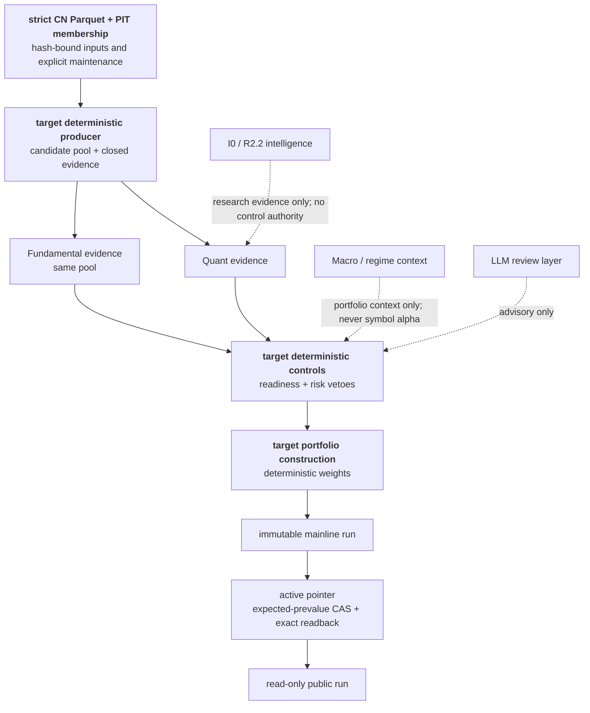

<div align="center">


**A fail-closed A-share research system with a V17-only public mainline.**

*Evidence is content-addressed, research is separated from authority, and a
missing result is never replaced by an invented one.*

[](https://www.python.org)
[](pyproject.toml)
[](LICENSE)

**English** · [简体中文](README.zh-CN.md)

[Purpose](#purpose) · [Current runtime](#current-runtime) · [Research intelligence](#research-intelligence) · [Governance target](#governance-target) · [Quick start](#quick-start) · [Current boundaries](#current-boundaries)

</div>

---

## Purpose

Quant-Investor is a CN A-share research repository organized around a simple
rule: every public conclusion must be traceable to exact evidence, and missing
authority must fail closed.

The repository contains several deliberately separate lanes:

- strict market-data maintenance and point-in-time inputs;
- Factor Governance and research-only forward evidence;
- the I0 Investment Intelligence library and R2.2 forward evaluator;
- a V17 v4 active-pointer contract with read-only Python, CLI, Web and
  Dashboard consumers;
- standalone legacy automation retained for compatibility, outside V17
  authority.

These lanes share code and evidence formats, but they do not silently grant one
another production or portfolio authority.

## Current runtime

The implemented public V17 flow is a reader, not a decision-run builder:

```text
results/v17_mainline/strategies/<strategy-id>/_active.json
  -> validate exact active pointer
  -> validate exact immutable run and transitive closure
  -> project myquant.v17.v4.mainline-public-run.v1
  -> return the same read-only public run through Python, CLI, Web or Dashboard
```

All public readers resolve one exact pointer. They never scan for the newest
run, substitute a Shadow session, bootstrap an authority file, or fall back to
another protocol.

| Condition | Result | Writes |
|---|---|---:|
| Active pointer absent | `V17_MAINLINE_UNINITIALIZED` | 0 |
| Pointer, run or closure invalid | `V17_MAINLINE_BLOCKED:<blocker>` | 0 |
| Non-CN public request | `V17_MARKET_UNSUPPORTED` | 0 |
| Mainline backtest request | `V17_BACKTEST_UNAVAILABLE` | 0 |

All public result readers are read-only. The `v17_mainline` package also exports
low-level exact-once and compare-and-swap storage primitives, but those
primitives are not a governed production publisher, activation workflow or
production authority. This repository does not currently expose a production
publisher or activation command.

This boundary addresses four recurring failure modes:

| Failure | What it looks like from inside |
|---|---|
| **Evidence that does not survive its own window** | A short-window factor looks significant because overlapping forward labels inflate naive statistics, then decays on a longer horizon. |
| **Data that substitutes itself** | A missing Parquet partition becomes CSV, stale or inferred data without disclosing which bytes produced the result. |
| **Definitions that move** | A factor changes meaning when its reference production set changes, so recorded evidence no longer describes the current definition. |
| **Language models with decision authority** | A model-generated weight enters the control path and removes the deterministic answer to “why this position?”. |

> **Every number must carry replayable evidence of how it was produced. Absence
> of evidence is a refusal, never a default.**

## Research intelligence

V17 research is split into an observation lane and an offline intelligence
lane:

```text
explicit V4 Forward request
  -> research-only Shadow observation and exact source closure
  -> I0 Evidence records
  -> Bayesian diagnostic + three-layer causal Regime + branch Fusion
  -> falsifiable Hypothesis + immutable Memory value
  -> exact R2.2 evaluation request
  -> stdout-only evaluation envelope + Memory Append Proposal
```

### I0 Markov regime

Markov has not been removed. Its implemented form is intentionally narrower
than the old production overlay:

- three independent layers: Market, Industry and Theme;
- exactly one forward filter step from an explicit content-addressed
  `RegimeInput`;
- source references must belong to the observation's verified recursive
  closure;
- no backward smoothing, fitting, hidden history lookup or persistence writer;
- no position cap, risk overlay, portfolio, selector, broker, order or trade
  authority.

R2.2 consumes only the selected state for each layer when it computes
regime-conditioned research metrics. It does not accept posterior maps as
aggregation input and does not update the Markov model.

### What is not automated

I0 and R2.2 are libraries plus an explicit CLI command. There is currently no
V17 research-intelligence scheduler, daemon, daily request generator, Memory
CAS writer, or paper-portfolio adapter. A missing optional Regime binding is
reported as unavailable; an invalid supplied binding blocks the evaluation.

The repository also contains restored standalone automation under
`quant_investor/automation/`. It is an incomplete legacy lane with no public
V17 entrypoint and missing lazy runtime dependencies. It is not the I0/R2.2
daily loop and cannot create mainline authority.

## Governance target

The intended producer topology remains useful as a governance contract, but it
must not be confused with the current public command implementation. The nodes
below are target responsibilities; their appearance in the diagram does not
claim that a registered end-to-end producer currently exists.


```mermaid
flowchart TD
    D["<b>strict CN Parquet + PIT membership</b><br/>hash-bound inputs and explicit maintenance"] --> F["<b>target deterministic producer</b><br/>candidate pool + closed evidence"]
    F --> Q["Quant evidence"]
    F --> FD["Fundamental evidence<br/>same pool"]
    MA["Macro / regime context"] -. "portfolio context only; never symbol alpha" .-> C
    Q --> C["<b>target deterministic controls</b><br/>readiness + risk vetoes"]
    FD --> C
    C --> PC["<b>target portfolio construction</b><br/>deterministic weights"]
    PC --> MR["immutable mainline run"]
    MR --> AP["active pointer<br/>expected-prevalue CAS + exact readback"]
    AP --> PB["read-only public run"]
    I0["I0 / R2.2 intelligence"] -. "research evidence only; no control authority" .-> Q
    LLM["LLM review layer"] -. "advisory only" .-> C
```

Any future producer must close every input and output reference, keep advisory
model output outside deterministic controls, persist an immutable run, and
advance the strategy pointer only through expected-prevalue CAS plus exact
readback. Merging or deploying code is never activation.

## Factor governance

Factor Governance v4 keeps factor research separate from activation. Its
evidence surface includes data safety, coverage, RankIC/IC, group returns,
cost and turnover, neutralization, purged out-of-sample robustness, portfolio
increment, trial correction, family-level multiplicity correction and maturity
checks.

Readiness is resolved from the exact current artifacts at runtime. This README
does not pin candidate counts, session counts or readiness values that can
become stale. Mining and diagnostic evidence are report-only unless a separate
governed activation contract is satisfied.

## Quick start

```bash
uv sync
cp .env.example .env
```

Local verification is offline by default. Fill only credentials required by an
explicitly authorized maintenance workflow.

Three compatibility commands read the same V17 active pointer:

```bash
quant-investor research run --workspace-root /absolute/path/to/myQuant --strategy-id <strategy-id>
quant-investor market analyze --workspace-root /absolute/path/to/myQuant --strategy-id <strategy-id>
quant-investor market run --workspace-root /absolute/path/to/myQuant --strategy-id <strategy-id>
```

Market maintenance is separate and may use external providers only when the
operator explicitly authorizes it:

```bash
quant-investor market maintain --market CN --staged
quant-investor market storage-validate --market CN
```

Create research-only V4 Forward observations from an exact request:

```bash
quant-investor-v17-v4 run-forward \
  --workspace-root /absolute/path/to/myQuant \
  --request-path <request.json> \
  --request-sha256 <sha256>
```

Evaluate matured evidence with R2.2:

```bash
quant-investor-v17-v4 research-evaluate \
  --workspace-root /absolute/path/to/myQuant \
  --request-path data/private/research_intelligence/evaluation_requests/forward-evaluation-request-<sha256>.json \
  --request-sha256 <sha256>
```

The evaluator writes no result file. It emits one canonical JSON envelope to
stdout; Memory persistence remains a separate caller-owned CAS operation.

## Current boundaries

- The supported public decision protocol is `myquant.v17.v4`, CN only.
- Public commands are read-only active-pointer consumers.
- There is no public mainline publisher, activation CLI or mainline backtest.
- Shadow, I0 and R2.2 are research-only and have no broker, execution, order or
  trade authority.
- Markov is present as a three-layer, one-step causal research filter; there is
  no production Markov environment switch or persistent risk overlay.
- There is no automatic paper-portfolio or Investment Memory writer.
- Standalone legacy automation is not a V17 authority surface.

## Project map

```text
quant_investor/
  automation/                standalone incomplete legacy automation
  cli/                       public command routing
  data/                      data providers and universe helpers
  factors/                   Factor Governance and research evidence
  intelligence/              I0 plus the R2.2 offline evaluator
  macro/                     source-bound macro observation helpers
  market/                    market maintenance and canonical reads
  pipeline/                  read-only V17 public Python facade
  v17_mainline/              active-pointer validation and public projection
  v17_v3_contract/           historical compatibility validators and resources
  v17_v4_contract/           V17 v4 schemas and validators
  v17_v4_runtime/            research-only Forward/Shadow runtime
portfolio_dashboard/         read-only V17 DTO consumer
web/                         local API; V17 research route is read-only
docs/                        architecture, runbooks and reviews
```

## Development

Python 3.13+. Run the narrowest relevant tests first. For broad shared changes:

```bash
PYTHON=./.venv/bin/python scripts/staged_upgrade_quality_gate.sh
```

Do not call live data, LLM, broker, order, execution or trade APIs during local
verification unless the task explicitly authorizes it.

## Documentation

- [Documentation index](docs/README.md)
- [V17 v4 mainline contract](docs/architecture/v17_v4_production_research_contract.md)
- [Entrypoints and versioning](docs/architecture/entrypoints_and_versioning.md)
- [Forward-evidence runtime](docs/architecture/v17_v4_forward_evidence_runtime.md)
- [Investment Intelligence I0](docs/architecture/v17_i0_investment_intelligence.md)
- [Forward Research Evaluator R2.2](docs/architecture/v17_r22_forward_research_evaluator.md)
- [Factor Governance v4](docs/factor_governance_v4.md)
- [Factor mining mechanism](docs/factor_mining_mechanism.md)
- [V17 v4 operations](docs/runbooks/v17_v4_operations.md)
- [Legacy configuration cleanup](docs/runbooks/v17_legacy_configuration_cleanup.md)
- [Module map](docs/modules/module_map.md)
- [Agent guide](AGENTS.md)

## License

[MIT](LICENSE) © 2024 alpha-mw
