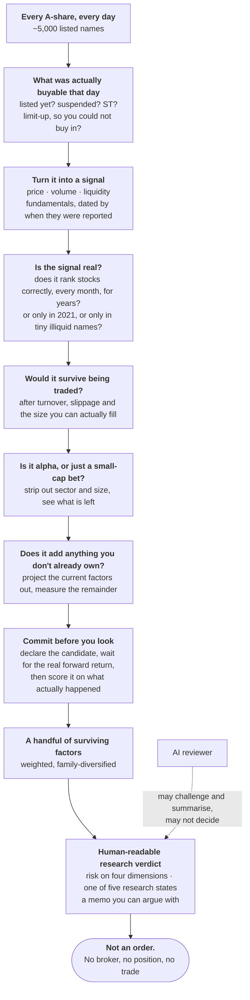

<div align="center">


**An A-share factor research system built around admission evidence, not backtests.**

*Generating signals is cheap. Knowing which of them is real — after paying for
point-in-time data, overlapping labels, and the size of your own search — is the
entire job.*

[](https://www.python.org)
[](pyproject.toml)
[](LICENSE)

**English** · [简体中文](README.zh-CN.md)

[Why](#why-this-exists) · [How it researches A-shares](#how-it-researches-a-shares) ·
[Factor admission](#the-core-the-factor-admission-machine) ·
[Data layer](#the-data-layer-it-stands-on) ·
[How it differs](#how-this-differs-from-a-backtest-framework) ·
[Run it](#how-it-runs) · [Current state](#current-state)

</div>

---

## Why this exists

Every quant project can produce a signal. Enumerate `family × window` over price,
volume and fundamentals and you have several hundred candidates in an afternoon.
Rank them by IC, keep the top five, plot the equity curve. It always looks good.

That is the trap, and it is not a coding problem. It is a measurement problem
with four distinct parts, each of which quietly inflates the result:

1. **The label overlaps itself.** A daily RankIC against a 30-session forward
   return shares its window with the 29 observations around it. A naive iid
   t-test on that series inflates significance by roughly `√30`. Measured on
   this repository's own five "production" factors, **two of the five stop being
   significant** once the overlap is corrected by Newey-West at lag 30 or by
   non-overlapping 30-session cohorts. They had passed 8/8 gates.
2. **The search pays for itself.** The maximum of 230 noisy ICIRs is biased
   upward even when every candidate is worthless. Reporting the winner's raw
   statistic is exactly how a factor zoo is built.
3. **The data is not point-in-time unless you make it so.** Fundamentals are
   restated. Membership changes. A market-cap column reconstructed from one
   as-of share-count snapshot multiplied by close is a look-ahead leak wearing a
   plausible name — and this repository shipped one for months without noticing.
4. **The candidates are all the same candidate.** In the run of 2026-08-01, nine
   of 230 candidates showed a positive portfolio increment, and all nine sat at
   0.81–1.00 correlation with factors already held. The search had spent its
   entire budget rediscovering `low_dollar_volume` at slightly different windows.

None of these produce an exception. They produce a plausible number. So this
repository is not organized around producing returns — it is organized around
**producing a defensible admission decision about a factor**, and around
refusing to produce one when the evidence is missing.

> The deliverable is not an equity curve. It is a statement of the form *"this
> factor is admissible, here is every piece of evidence that says so, and here
> is the exact hash of each one"* — or an explicit named blocker instead.

## How it researches A-shares

The whole system is one funnel: start with every A-share, and at each step throw
away what cannot be justified. Almost everything gets thrown away — that is the
design working, not failing.


```mermaid
flowchart TD
    U["<b>Every A-share, every day</b><br/>~5,000 listed names"]
    P["<b>What was actually buyable that day</b><br/>listed yet? suspended? ST?<br/>limit-up, so you could not buy in?"]
    S["<b>Turn it into a signal</b><br/>price · volume · liquidity<br/>fundamentals, dated by when they were reported"]
    E["<b>Is the signal real?</b><br/>does it rank stocks correctly, every month, for years?<br/>or only in 2021, or only in tiny illiquid names?"]
    K["<b>Would it survive being traded?</b><br/>after turnover, slippage and the size you can actually fill"]
    N["<b>Is it alpha, or just a small-cap bet?</b><br/>strip out sector and size, see what is left"]
    X["<b>Does it add anything you don't already own?</b><br/>project the current factors out, measure the remainder"]
    W["<b>Commit before you look</b><br/>declare the candidate, wait for the real forward return,<br/>then score it on what actually happened"]
    R["<b>A handful of surviving factors</b><br/>weighted, family-diversified"]
    J["<b>Human-readable research verdict</b><br/>risk on four dimensions · one of five research states<br/>a memo you can argue with"]
    Z(["<b>Not an order.</b><br/>No broker, no position, no trade"])

    U --> P --> S --> E --> K --> N --> X --> W --> R --> J --> Z

    LLM["AI reviewer"] -. "may challenge and summarise,<br/>may not decide" .-> J
```

Two things about that funnel are worth saying out loud.

**The narrow steps are in the middle, not at the ends.** Most quant projects
spend their effort at the top (more data, more candidates) and at the bottom
(better optimiser). This one spends it on the four questions in the middle,
because that is where a plausible number turns into a false one.

**The last arrow is a wall.** A factor that survives the entire funnel produces a
research verdict, not a position. Turning research into a live portfolio is a
separate, deliberately unbuilt step — so nothing in this repository can quietly
graduate from "interesting" to "traded".

## The core: the factor admission machine

### The eight gates

`quant_investor/factors/governance.py` scores every candidate on eight
independent questions. Unknown evidence counts as failure — a gate with no
producer fails closed rather than passing on assumption.

| Gate | Question | Representative thresholds |
|---|---|---|
| 1 · data safety | Was every input knowable on the rebalance date? | versioned PIT/tradability audit per candidate |
| 2 · coverage & stability | Is the signal defined broadly, or concentrated in one corner? | coverage ≥ 60%, NaN ≤ 40%, no sector or size bucket above 80% |
| 3 · IC / RankIC | Is the cross-sectional edge real and persistent? | \|ICIR\| ≥ 0.30, positive-IC ratio ≥ 0.52, stable RankIC direction, no single year above 60% of total IC, family BH q ≤ 0.10 |
| 4 · group returns | Is the top-minus-bottom spread monotone? | monotonicity ≥ 0.35, positive spread and top return |
| 5 · cost & turnover | Does the edge survive being traded? | turnover ≤ 12×/yr, capacity pressure ≤ 0.75, positive cost-adjusted return |
| 6 · neutralization | Is it alpha, or is it a repackaged size/sector bet? | neutralized \|ICIR\| ≥ 0.20, correlation with the pool ≤ 0.70, explicit `style_exposure_only` flag |
| 7 · OOS & robustness | Does it hold outside the sample it was found in? | purged/embargoed CPCV positive-path ratio ≥ 0.55 |
| 8 · portfolio increment | Does adding it improve the *portfolio*? | positive return and Sharpe delta, drawdown delta ≤ 2%, turnover delta ≤ 30%, A/B/C/D replay with per-arm hashes |

Passing all eight is necessary and not sufficient. A *production candidate*
additionally needs `|ICIR| ≥ 0.50` and a positive-IC ratio ≥ 0.55, plus a
maturity route that is real: 12 distinct actual month-end RankIC sessions, or 8
non-overlapping cohorts of 30 consecutive open sessions taken from the exact
strict-Parquet calendar. A standalone 90-day diagnostic, weekend arithmetic or a
caller-declared horizon is not authoritative.

The set-level policy then does something most factor libraries never enforce:
with a 20% per-factor and 35% per-family absolute weight cap, a five-factor
baseline **mathematically requires five distinct families**. Family diversity
stops being a preference and becomes an arithmetic constraint.

Three further layers sit on top of the gates.

### Overlapping labels: combinatorial purged CV

Contiguous train/test folds leak in both directions when the label window is 30
sessions wide — which is why the previous out-of-sample diagnostic could report
a positive ratio of 1.0 for factors that do not survive an honest correction.

`quant_investor/factors/purged_cv.py` splits the session calendar into 10 blocks
and tests on all `C(10,2) = 45` block pairs. For each split it **purges**
training sessions whose label window reaches into a test block and **embargoes**
the 30 sessions immediately following each test block. Purge and embargo are
counted in trading sessions, not calendar days, so the 30-day requirement is
literal. The result is 45 backtest paths instead of one — which is precisely
what the statistics below need as input.

A caveat recorded in the code and honoured downstream: those 45 paths overlap
heavily (each block appears in nine of them), so the path ratio is *necessary
but not sufficient*. Pure noise clears 0.55 on individual draws.

### Paying for the size of the search

`quant_investor/factors/trial_correction.py` is the layer most personal quant
projects skip entirely.

- **Deflated Sharpe ratio** (Bailey & López de Prado). The run records how many
  candidates it scored and how widely their ICIRs varied, computes the ICIR the
  best of N worthless trials would be expected to reach, and deflates the
  observed ICIR by it — adjusting for skew, kurtosis and series length. Because
  the "return" series here is the per-rebalance RankIC series, its Sharpe *is*
  the ICIR already reported. Floor: 0.95.
- **Probability of backtest overfitting.** Combinatorially symmetric CV over the
  whole candidate set: 10 blocks, all 252 balanced in-sample/out-of-sample
  splits, nominate the in-sample winner, ask where it ranks out of sample.
  Ceiling: 0.5.
- **Non-overlapping cohort t-statistic** against Harvey, Liu & Zhu's **t > 3.0**
  hurdle, not the conventional 2.0. Cohorts are exactly one horizon wide, so the
  overlap is removed rather than modelled.
- **Effective trial count.** Seventy smoothing variants of one idea are one
  hypothesis, not seventy. Candidates are clustered by the absolute correlation
  of their IC series at the same 0.70 floor the redundancy gate uses, and the
  cluster count — not the raw candidate count — is what the deflated Sharpe is
  charged for.

These are strictly an extra bar. Nothing in the correction can qualify a
candidate the gates rejected.

### The objective is set-level, not standalone

`quant_investor/factors/incremental_alpha.py` projects the existing production
pool out of each candidate, cross-section by cross-section, with both sides
ranked first so the projection is scale-free. Ranking is then on gate score,
then **residualised** ICIR, with standalone ICIR demoted to a tie-break.

This is what turns redundancy from a late Gate 8 veto into the thing the search
optimises against. The effect on real data is not subtle:

| candidate | standalone RankIC | residual RankIC | retention | pool corr |
|---|---|---|---|---|
| `pv_low_dollar_volume_5d` | 0.1206 | 0.0112 | 0.47 | 1.00 |
| `pv_low_dollar_volume_10d` | 0.1189 | 0.0135 | 0.25 | 0.98 |
| `pv_low_dollar_volume_20d` | 0.1124 | 0.0036 | 0.06 | 0.95 |

The highest standalone RankIC in the entire run is already in production and
falls to position 95 of 230 once residualised. What rises in its place —
`fund_fin_ocf_to_profit`, retention above 1.0 because the pool was working
*against* it — is the kind of family-diversifying candidate the five-factor
baseline mathematically requires, and standalone ranking buried it.

### What the machine currently says

This section is the reason to trust the rest of the README.

On run `factor_v4_mining_20260805_stage3`, 230 candidates over 2021-08 to
2026-06:

| | value |
|---|---|
| best gate score reached | 5 / 8 |
| candidates clearing `t > 3.0` | 94 / 230 |
| PBO | 0.048 — the ranking is *stable* |
| best observed ICIR | 0.724 |
| expected best-of-230 ICIR under the null | 1.067 |
| candidates clearing DSR ≥ 0.95 | **0 / 230** |

Read together, those last three lines are a directional finding rather than a
flat rejection: the selection is not fitting noise, but the effect sizes are too
small for a search this wide. Which says the way forward is **not** to enumerate
more candidates — a bigger search raises the bar every candidate must clear —
but to cut the trial count with pre-registration, or to find larger effects.

Gates 1, 5 and 8 still have no evidence producer and therefore fail closed. **No
candidate is currently admissible, and the repository says so rather than
lowering a threshold.** The full diagnosis, the sensitivity of the verdict to
the effective-N bracket, and the ordered plan are in
[Factor mining mechanism](docs/factor_mining_mechanism.md).

### Governance v5: pre-registration, and a backtest that cannot admit

The v4 verdict above — *stop enumerating, cut the trial count* — is a
recommendation, and recommendations decay. `quant_investor/factors/governance_v5/`
turns it into a protocol that a retrospective result cannot route around.

Everything in v5 is a sealed, content-addressed, exactly-replayable receipt, and
every receipt declares a **lane**:

| Lane | Receipt | Can it admit a factor? |
|---|---|---|
| `PROSPECTIVE_ONLY` | prospective evaluation | **Yes** — the only lane that can |
| `BACKTEST_SUPPORT_ONLY` | historical support projection | No — carries `admission_eligible: false` |
| `DIAGNOSTIC_ONLY` | diagnostic scan | No — carries `promotion_eligible: false`, purpose is *next-cycle preregistration proposal only* |

That table is the whole argument. A backtest can support a case; it can never
close one. The best a scan of the historical panel can earn is the right to
*propose a candidate for the next cycle's pre-registration*.

The pre-registration itself is enforced the way a trial protocol is, not the way
a comment is:

- **Sealed before the outcome exists.** `build_preregistration` rejects any
  document whose `label_available_at` is not strictly after its seal time, and
  records `sealed_before_label_available: true`. You commit to the candidate
  list while the label is still unknowable.
- **Evaluation is bound to the declaration.** A prospective evaluation whose
  candidate is not in the pre-registration is a contract error, as is one dated
  before the label became available.
- **Coverage decisions close before the label opens.** A coverage receipt must be
  computed after the cutoff and *strictly before* `label_reader_permitted_at` —
  so "this input was too sparse" can never be a judgement made after seeing how
  the factor did.
- **Substitutions are pre-declared contingencies.** Swapping a candidate requires
  the primary's coverage to have `FAILED`, the alternate's to have `PASSED`, and
  the alternate to have been declared `ALTERNATE_FOR:<primary>` in the sealed
  document — before the label reader opens. There is no post-hoc swap.
- **Validation is replay, not hash-checking.** Every validator rebuilds the
  document from its inputs and demands byte-for-byte equality. Re-sealing an
  edited artifact does not survive.

Admitted weights are then derived, not chosen: purged out-of-sample shrinkage
plus largest-remainder apportionment in exact `Decimal`, which is checked to sum
to exactly 1.

The trade-off is explicit and it is the point. **Under v5, a factor costs a real
holding period to admit** — you must declare it, wait for the label, and evaluate
on the paths that pre-registration bought you. That is much slower than mining.
It is also the only version of this pipeline where a passing result means what
it appears to mean.

## The data layer it stands on

None of the statistics above mean anything on data that leaks. The canonical
store is strict CN Parquet with:

- **Point-in-time membership.** `cn_pit_universe` records who was listed and
  investable on each date, with generation lineage and manifests, so the
  universe is reconstructed rather than assumed.
- **A governed fundamental generation.** Every row carries an
  `availability_date`; sector and market cap are read from that generation and
  hash-bound to its manifest. The previous loader reconstructed 27% of its market
  caps from a single as-of share-count snapshot — that path is gone.
- **Size buckets as cross-sectional terciles**, not fixed absolute thresholds. A
  rising market sweeps every stock into `large` under absolute cut-offs, and
  neutralization silently stops removing any size exposure at all.
- **A-share microstructure in the audit path.** Suspension, limit-up (buy
  blocked), limit-down (sell blocked) and ST status are first-class tradability
  fields, not a footnote to a fill assumption.
- **No hidden substitution.** A missing Parquet partition does not become CSV, a
  stale snapshot, or an inferred value. Maintenance is an explicit operator
  workflow; an analysis command never starts a provider call to patch an input
  behind your back.
- **Reason-coded coverage intervals.** A gap in the fundamental mart is not a
  bare NaN. Coverage boundaries are declared and validated with an explicit
  reason, so "not yet reported", "suspended" and "we never fetched it" stay
  distinguishable — the distinction that decides whether a Gate-2 coverage
  failure is a fact about the stock or a fact about the pipeline.
- **Suspension-aware history.** A suspended stock is not silently forward-filled
  into a tradable observation, and the history builder carries the suspension
  state that the tradability audit later reads.
- **Guarded, staged maintenance.** Fundamental generations are built into
  staging, verified, and promoted atomically against an expected pointer SHA.
  History backfills (now reaching back to 2015) and implausible-bar-date
  quarantine are separate, reviewable operations rather than in-place edits.
- **Content-bound everything.** Manifests, snapshots and evidence carry SHA-256
  bindings, so an artifact cannot be swapped after the fact without the
  validation failing.

Delisting and secondary-source evidence live in `quant_investor/market/`; the
cleaning contract is documented in
[Tushare data cleaning](docs/tushare_data_cleaning.md).

## Beyond factors

**Forward / Shadow evidence.** Research observations are collected only from
exact, content-bound requests and remain future-only. A completed Shadow session
cannot advance the active pointer or become the public portfolio result.

**I0 investment intelligence.** Deterministic Evidence records, Bayesian
likelihood diagnostics, three independent causal Regime layers (Market, Industry,
Theme), availability-aware branch Fusion, falsifiable Hypotheses and immutable
Memory. Each Regime layer performs exactly one forward Markov filter step from
explicit inputs — no backward smoothing, no hidden-history search, no
persistence writer. Regime is a *diagnostic*, not a position cap.

**R2.2 evaluator.** `research-evaluate` replays one exact request offline and
emits one canonical envelope to stdout. It may propose a Memory suffix; it does
not write it, call a provider, change a factor tier, choose a portfolio or touch
the active pointer.

**I1 investment decision intelligence.** A library-only layer that turns a fully
replayed research closure into a reviewable memo and a disciplined research
state. It assesses `BUSINESS`, `FINANCIAL`, `MARKET` and `THESIS` risk
independently — unavailable dimensions stay explicitly unavailable rather than
defaulting to benign — and returns exactly one of five states in fixed
precedence:

| Priority | State | Meaning |
|---:|---|---|
| 1 | `THESIS_INVALIDATED` | A **preregistered** R2.2 hypothesis evaluation came back `FAILED` |
| 2 | `INSUFFICIENT_EVIDENCE` | A required availability class or risk dimension is unavailable |
| 3 | `WATCHLIST` | Inputs exist, but a veto or a confidence/posterior/risk gate fails |
| 4 | `RESEARCH_APPROVED` | Research gates pass, a stricter paper-review gate does not |
| 5 | `PAPER_CANDIDATE` | Research and paper-review gates both pass |

Two details carry the design. Only a *preregistered* failed hypothesis can
invalidate a thesis — a post-hoc hypothesis that looks like a failure returns
`UNCERTAIN` and cannot, which is the same anti-hindsight rule as Governance v5,
applied to narrative instead of factors. And `PAPER_CANDIDATE` is the ceiling:
it means eligibility for external paper review, not stock selection, portfolio
admission, a position, a target price, `BUY`/`SELL`/`HOLD`, an order or a trade.
The paper adapter is a `Protocol` the library never implements or calls.

The memo is a projection, not a narrator: it may copy the validated hypothesis,
admitted evidence, validated risk reasons, context notes and allowlisted AI
drafts, and nothing else. Missing "why now" context stays missing rather than
being written into prose.

**Portfolio readiness.** `portfolio cycle-status` validates an explicitly
supplied strategy identity and holdings closure and returns a read-only
readiness document. It does not discover "current" holdings by directory order.
Readiness is a chain — identity, holdings, canonical data, factor state, risk
policy, portfolio policy, publication, activation — and verifying one link never
grants the others.

**LLM as reviewer, never as decider.** A model may summarize evidence, challenge
a conclusion or draft a hypothesis. It cannot alter the evidence closure, the
candidate set, a risk limit, a weight, the pointer or any trade state. There is
always a deterministic answer to "why this position?".

## How this differs from a backtest framework

Qlib, backtrader, vectorbt and zipline are excellent at the question *"what would
this have returned?"*. This repository is built for the question *"should I
believe it?"* — and those need opposite defaults.

| | Typical backtest-first project | This repository |
|---|---|---|
| Deliverable | An equity curve and a ranked factor list | An admission verdict with hashed evidence, or a named blocker |
| Default on missing evidence | Fill a default, warn, continue | Fail closed; the gate scores zero |
| Multiple testing | Family BH at the end, if at all | DSR, PBO, effective-N and t > 3.0 as an admission bar |
| Pre-registration | None; the candidate list is whatever the script enumerated | Sealed before the label exists; unregistered candidates cannot be evaluated |
| What a backtest can conclude | Everything — it *is* the decision | Nothing. `BACKTEST_SUPPORT_ONLY` may support a case and propose a next-cycle candidate |
| Label overlap | Ignored; iid t-test on daily IC | CPCV with literal session purge/embargo, plus non-overlapping cohort t-tests |
| Search objective | Standalone IC / ICIR | Residual against the production pool — redundancy is what the ranking optimises against |
| Point-in-time | A convention in the loader | Enforced by generation storage, `availability_date` and manifest hashes |
| Redundancy | Late rejection | First-class objective and effective-trial input |
| Research → production | The same script; a good backtest is the decision | Separate schema and storage families; activation is an independent governed contract |
| LLM | Sometimes in the decision path | Advisory only, structurally excluded from candidates, limits and weights |
| Negative results | Not published | Published, dated, and left in the README |

The trade-off is honest: this system is **slower to say yes** and will hold a
factor out that a permissive pipeline would have traded. That is the intended
asymmetry. On a market where the same overlapping-label mistake passes five
factors that should have passed three, the expensive error is not the missed
factor.

## The failures it is designed to prevent

| Classic failure | Mechanism |
|---|---|
| **Look-ahead / survivorship bias** | PIT membership, `availability_date` per row, explicit cutoffs, availability-aware evidence contracts |
| **Silent data substitution** | Strict canonical Parquet, hash-bound manifests, no CSV or latest-file fallback |
| **Overlapping-label significance** | Newey-West and non-overlapping cohorts on RankIC; CPCV with session-counted purge and embargo |
| **Backtest overfitting** | Deflated Sharpe, PBO, effective trial count, Harvey t > 3.0 |
| **Hindsight dressed as a hypothesis** | v5 pre-registration sealed before the label exists; pre-declared substitution only; only a preregistered failed hypothesis can invalidate an I1 thesis |
| **Research approval mistaken for a trade** | Five explicit I1 research states; even `PAPER_CANDIDATE` grants only external paper-review eligibility |
| **Factor zoo / redundancy** | Pool-residualised objective, 0.70 correlation ceiling, family BH q ≤ 0.10, family-diversity requirement |
| **Style bets sold as alpha** | Sector × size neutralization on PIT exposure, explicit `style_exposure_only` flag, terciles not absolute thresholds |
| **Paper alpha that cannot be traded** | Turnover and capacity gates, cost-adjusted returns, suspension / limit-board / ST tradability audits |
| **Non-causal regime analysis** | One explicit forward Markov step per layer, no backward smoothing or hidden history |
| **Research mistaken for production** | Separate schema and storage families for Shadow, I0/R2.2, factor evidence and public mainline |
| **Model output becoming a decision** | LLM advisory only; deterministic contracts are the sole source of candidates, limits and weights |
| **Code merge mistaken for activation** | Deploy state and active-pointer state checked and reported separately |
| **Portfolio inputs inferred from old files** | Explicit identity and holdings references; no newest-by-time discovery |

## How it runs

### 1. Maintain canonical market data

```bash
quant-investor market maintain --market CN --staged
quant-investor market storage-validate --market CN
quant-investor market fundamental-maintain --market CN --universes hs300,zz500,zz1000
```

Provider access is separate and requires explicit operator authorization. A
successful storage validation proves the exact checks it ran; it is not an
investment decision.

### 2. Read an active V17 result

These compatibility commands resolve the same exact strategy pointer and return
the same read-only authority chain:

```bash
quant-investor research run \
  --workspace-root /absolute/path/to/myQuant \
  --strategy-id <strategy-id>

quant-investor market analyze --workspace-root /absolute/path/to/myQuant --strategy-id <strategy-id>
quant-investor market run     --workspace-root /absolute/path/to/myQuant --strategy-id <strategy-id>
```

Expected explicit states — each names what is missing rather than substituting a
result:

| Condition | Result | Writes |
|---|---|---:|
| Active pointer absent | `V17_MAINLINE_UNINITIALIZED` | 0 |
| Pointer, run or closure invalid | `V17_MAINLINE_BLOCKED:<blocker>` | 0 |
| Market is not CN | `V17_MARKET_UNSUPPORTED` | 0 |
| Mainline backtest request | `V17_BACKTEST_UNAVAILABLE` | 0 |

### 3. Accumulate Forward / Shadow evidence

```bash
quant-investor-v17-v4 run-forward \
  --workspace-root /absolute/path/to/myQuant \
  --request-path data/private/v17_v4_runs/forward_requests/<request_id>.json \
  --request-sha256 <exact-byte-sha256>
```

### 4. Evaluate matured research evidence

```bash
quant-investor-v17-v4 research-evaluate \
  --workspace-root /absolute/path/to/myQuant \
  --request-path data/private/research_intelligence/evaluation_requests/forward-evaluation-request-<sha256>.json \
  --request-sha256 <exact-byte-sha256>
```

Offline and stdout-only.

### 5. Build a replayed I1 research decision

I1 is deliberately a Python library rather than a public command — a decision
this consequential should not be reachable by a shell one-liner. The caller
supplies the complete I0 replay closure and may bind one exact R2.2 request;
the library derives Context, Risk, Decision, Memo and Discipline values with no
persistence and no external calls:

```python
from quant_investor.intelligence.decision import (
    assess_investment_risk,
    build_investment_memo,
    collect_investment_decision_context,
    make_investment_decision,
)
```

Clearing the stricter paper-review gates yields `PAPER_CANDIDATE`, which permits
constructing a minimal `PENDING_EXTERNAL_REVIEW` proposal for a separately
governed external workflow — and nothing else.

### 6. Diagnose portfolio-cycle inputs

```bash
quant-investor portfolio cycle-status --help
```

Requires explicit canonical paths, exact SHA-256 bindings and a decision cutoff.

## Current state

CN-only. No broker, order, execution or trade authority.

**Implemented:**

- the eight-gate factor evaluator with CPCV, trial-aware correction, effective-N
  clustering and the pool-residualised ranking objective;
- Governance v5: sealed pre-registration, prospective-only admission, coverage
  and substitution receipts, and deterministic shrinkage weighting, isolated in
  `quant_investor/factors/governance_v5/`;
- PIT universe, governed fundamental generation with reason-coded coverage
  intervals and suspension-aware history, guarded staging/promotion, strict
  Parquet maintenance and storage validation;
- exact active-pointer validation and a read-only public run projected over
  Python, CLI and Dashboard;
- explicit V4 Forward / Shadow observation;
- deterministic I0 investment intelligence and R2.2 evaluation;
- library-only I1 investment decision intelligence: exact I0 / optional R2.2
  replay, four-dimensional risk, five research states, deterministic memo and
  an append-only decision-discipline chain;
- read-only portfolio identity, holdings and readiness diagnostics.

**Not implemented as a public operational workflow:**

- evidence producers for v4 Gates 1, 5 and 8 — so v4 factor admission is
  currently blocked by design;
- a search over the expression space (the evaluators in
  `quant_investor/factors/aquant_expression.py` and `aquant_expression_v5.py`
  exist; the search does not);
- an end-to-end decision-run producer, production publisher or activation
  command;
- a public I1 CLI, Web route, scheduler, persistence/Memory writer, or any
  implementation of the paper-portfolio adapter — I1 is a library and the
  adapter is an interface the library never calls;
- an automatic I0/R2.2 scheduler or request generator;
- a portfolio-cycle producer, paper-ledger writer or learning orchestrator;
- broker, order, execution or trade integration.

The gap between the two lists is deliberate and documented rather than papered
over. Building the search engine before the evaluation can tell a real candidate
from a lucky one would manufacture exactly the factor zoo this project exists to
avoid.

## Quick start

```bash
uv sync
cp .env.example .env
```

Local verification is offline by default. Fill only the credentials an
explicitly authorized maintenance workflow needs.

```bash
quant-investor --help
quant-investor-v17-v4 --help
```

## Project map

```text
quant_investor/
  factors/                   8 gates, CPCV, trial correction, incremental alpha,
                             exposure maps, tradability, capacity, expressions
  factors/governance_v5/     sealed pre-registration and prospective-only admission
  market/                    CN maintenance, PIT universe, fundamental generation
  data/                      data sources and point-in-time processing
  intelligence/              I0 and R2.2 research-only intelligence
  intelligence/decision/     library-only I1 decision intelligence
  portfolio_cycle/           identity, holdings and readiness foundation
  v17_mainline/              active-pointer contract and public run reader
  v17_v4_contract/           V17 v4 schemas and validation
  v17_v4_runtime/            Forward / Shadow observation runtime
  cli/                       public command routing
portfolio_dashboard/         read-only Dashboard contract
scripts/                     mining, readiness and evidence build entrypoints
results/v17_mainline/        active-result namespace, when state exists
results/v17_v4_shadow/       research-only forward-evidence namespace
```

## Development

Python 3.13+ — the factor-governance AST identity protocol pins
`ast.parse(optimize=...)` and `ast.dump(show_empty=True)`, which are 3.13-only.

Run the smallest relevant checks first. The full local equivalent of CI is:

```bash
uv run pytest tests/unit -q
uv run flake8 quant_investor --count --select=E9,F63,F7,F82 --show-source --statistics
uv run mypy quant_investor/factors --ignore-missing-imports
```

To clear local caches:

```bash
find . -name __pycache__ -type d -not -path './.venv/*' -exec rm -rf {} + ; rm -rf .mypy_cache .pytest_cache .uv-cache results/htmlcov
```

Do not call live Tushare, yfinance, LLM, broker, order, execution or trade APIs
during local verification unless the task explicitly authorizes them.

## Documentation

- [Documentation index](docs/README.md)
- [Factor mining mechanism](docs/factor_mining_mechanism.md) — the diagnosis, the statistics and the ordered plan
- [Factor Governance v4](docs/factor_governance_v4.md) — gates, maturity, BH, readiness states
- [Tushare data cleaning](docs/tushare_data_cleaning.md)
- [Research pipeline and protocols](docs/architecture/research_pipeline_and_protocols.md)
- [V17 v4 mainline contract](docs/architecture/v17_v4_production_research_contract.md)
- [I0 Investment Intelligence](docs/architecture/v17_i0_investment_intelligence.md)
- [R2.2 Forward Research Evaluator](docs/architecture/v17_r22_forward_research_evaluator.md)
- [I1 Investment Decision Intelligence](docs/architecture/v17_i1_investment_decision_intelligence.md)
- [Portfolio-cycle foundation](docs/architecture/v17_portfolio_cycle_foundation.md)
- [Trading discipline](docs/trading_discipline.md)
- [V17 v4 operations](docs/runbooks/v17_v4_operations.md)
- [Agent guide](AGENTS.md)

### Selected references

The statistical machinery follows the standard literature rather than inventing
its own: Harvey, Liu & Zhu (RFS 2016) for the t > 3.0 hurdle; Bailey & López de
Prado for the deflated Sharpe ratio and PBO; purged/embargoed CPCV for
overlapping labels; AlphaGen and AlphaForge for the set-level objective; Qlib's
Alpha158/Alpha360 as the reference operator × field × window space. Full
citations are in [Factor mining mechanism](docs/factor_mining_mechanism.md).

## License

[MIT](LICENSE) © 2024 alpha-mw
