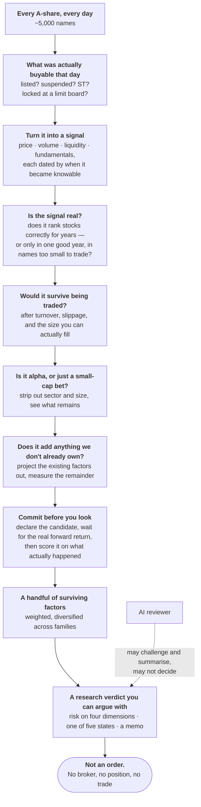

<div align="center">


**An A-share research system built to say no.**

*Most quant platforms are optimised to find signals. This one is optimised to
disqualify them. In A-shares, that is the scarcer capability — and the one that
decides whether research survives contact with the market.*

[](https://www.python.org)
[](pyproject.toml)
[](LICENSE)

**English** · [简体中文](README.zh-CN.md)

[Problem](#the-problem) · [Thesis](#the-thesis) · [What we built](#what-we-built) ·
[The funnel](#how-it-researches-a-shares) · [Why it's different](#why-this-is-different) ·
[Evidence](#evidence-to-date) · [Status](#where-it-stands)

</div>

---

## The problem

A-share factor research has an abundance problem, not a scarcity problem.
Hundreds of plausible signals are a morning's work. What almost nobody has is a
defensible way to tell which of them survive contact with reality.

Reality, here, means five things at once: fundamentals that get restated after
the fact, stocks that were suspended or locked at a limit board when your
backtest happily traded them, return windows that overlap and inflate every
significance test built on them, a search process that makes your best result
look better the harder you look, and a candidate list that is usually one idea
wearing two hundred different parameter settings.

None of these throw an error. Each of them returns a perfectly plausible number.
The industry-wide failure mode is not a crash — it is research that backtests
beautifully and loses money quietly.

## The thesis

**The bottleneck in quant is adjudication, not generation.**

Every serious source of error in factor research is some version of accidentally
seeing the future. Each has a known correction in the literature. Every one of
those corrections is expensive to compute, unglamorous to build, and trivially
easy to skip — so almost everyone skips them, and the skipping is invisible in
the output.

A system that runs those corrections by default, and refuses to return a
conclusion when it cannot, is worth more than a system that returns conclusions
faster.

> So the deliverable is not an equity curve. It is a verdict with its evidence
> attached — or an explicit, named refusal.

## What we built

| Pillar | What it is | Why it matters |
|---|---|---|
| **A market record that cannot lie about time** | Every price, fundamental and index membership is stored with the date it actually became knowable, alongside suspension, limit-board and ST state | Removes look-ahead and survivorship at the source, rather than trusting each researcher to remember |
| **An adjudication engine** | Eight independent admission tests, from "was this knowable?" through cost, capacity, neutralisation and portfolio contribution | A factor must answer all eight; missing evidence counts as failure, never as a pass |
| **Honest statistics, on by default** | Corrections for overlapping return windows, for the size of the search, and for the fact that most candidates are the same candidate | This is the layer almost every project omits, and the one that changes the answer most often |
| **A pre-registration protocol** | Candidates are declared and sealed *before* the outcome exists; a historical backtest can support a case but can never close one | Makes hindsight structurally impossible instead of merely discouraged |
| **A decision layer humans can argue with** | Risk assessed on four dimensions, one of five explicit research states, and a memo that may only cite validated evidence | Turns a number into a reviewable investment case — that stops short of being a trade |

Around all of it sits one rule: **AI reviews, deterministic logic decides.** A
model can summarise evidence, challenge a conclusion, or draft a hypothesis. It
cannot set a score, a threshold, a weight, or a decision. There is always a
mechanical answer to "why this position?".

## How it researches A-shares

One funnel. Start with every A-share; at each step discard whatever cannot be
justified. Almost everything is discarded — that is the design working.


```mermaid
flowchart TD
    U["<b>Every A-share, every day</b><br/>~5,000 names"]
    P["<b>What was actually buyable that day</b><br/>listed? suspended? ST?<br/>locked at a limit board?"]
    S["<b>Turn it into a signal</b><br/>price · volume · liquidity · fundamentals,<br/>each dated by when it became knowable"]
    E["<b>Is the signal real?</b><br/>does it rank stocks correctly for years —<br/>or only in one good year, in names too small to trade?"]
    K["<b>Would it survive being traded?</b><br/>after turnover, slippage, and the size you can actually fill"]
    N["<b>Is it alpha, or just a small-cap bet?</b><br/>strip out sector and size, see what remains"]
    X["<b>Does it add anything we don't already own?</b><br/>project the existing factors out, measure the remainder"]
    W["<b>Commit before you look</b><br/>declare the candidate, wait for the real forward return,<br/>then score it on what actually happened"]
    R["<b>A handful of surviving factors</b><br/>weighted, diversified across families"]
    J["<b>A research verdict you can argue with</b><br/>risk on four dimensions · one of five states · a memo"]
    Z(["<b>Not an order.</b><br/>No broker, no position, no trade"])

    U --> P --> S --> E --> K --> N --> X --> W --> R --> J --> Z

    LLM["AI reviewer"] -. "may challenge and summarise,<br/>may not decide" .-> J
```

Two features of that shape matter more than any single step.

**The narrow part is in the middle.** Most projects spend their effort at the
top — more data, more candidates — and at the bottom, on a better optimiser.
This one spends it on the four questions in the middle, because that is where a
plausible number becomes a false one.

**The last arrow is a wall.** Surviving the funnel produces a research verdict,
not a position. Converting research into a live portfolio is a separate step
that is deliberately not built, so nothing here can quietly graduate from
"interesting" to "traded".

## Why this is different

Qlib, backtrader, vectorbt and zipline are excellent at *"what would this have
returned?"*. This system is built for *"should I believe it?"* — and the two
questions need opposite defaults.

| | Backtest-first platforms | This system |
|---|---|---|
| The deliverable | An equity curve and a ranked factor list | A verdict with its evidence, or a named refusal |
| When evidence is missing | Fill a default, warn, continue | Stop. Missing evidence is a failure, not a gap |
| Multiple testing | An afterthought, if present | An admission bar the candidate must clear |
| What a backtest proves | Everything — it *is* the decision | Nothing on its own. It can support a case; it cannot close one |
| Search objective | The strongest signal | The signal that adds most to what we already hold |
| Research → production | The same script; a good backtest is the decision | Two separate systems, and the bridge is deliberately unbuilt |
| Negative results | Not published | Published, dated, and left in this README |

The trade-off is explicit: **this system is slower to say yes**, and will hold
back a factor a permissive pipeline would already be trading. That asymmetry is
chosen. In a market where the same overlapping-window mistake passes five
factors that should have passed three, the expensive error is not the one you
miss.

## Evidence to date

The most useful thing a research system can produce is a credible negative, and
this one has produced several — on its own prior work.

- **Two of five factors already in production stop being significant** once the
  overlap in their return windows is corrected properly. They had previously
  passed every test the system had.
- **Of 230 candidates in a full mining run, zero cleared the search-cost bar.**
  The selection process was stable and not fitting noise; the effects were
  simply too small to justify a search that wide. The conclusion drawn was to
  *narrow the search*, not to widen it.
- **The highest-scoring candidate in that run turned out to be something we
  already owned.** Ranking on what a candidate adds, rather than on how strong
  it looks alone, moved it from first place to the middle of the pack — and
  surfaced a genuinely different one in its place.
- **A market-cap field that had quietly been reconstructed, not observed,** went
  undetected for months and was found and removed. Roughly a quarter of the
  values had been affected.

Under current standards no new factor is admissible, and the system says so
rather than lowering a threshold. That is the intended behaviour, not a defect
report.

## Where it stands

CN A-shares only. No broker, order, execution or trade authority — by design,
not by omission.

**Working today:** the point-in-time market record; the eight-test adjudication
engine with its statistical corrections; the pre-registration protocol; the
research decision layer; and read-only reporting through Python, a CLI and a
dashboard.

**Deliberately not built:** the bridge from research to a live portfolio. That
means no automated candidate search, no production publisher, no scheduler, no
paper-trading ledger and no broker connection. Each is a governed step that
should not appear by accident, and building a wider search before the
adjudication is complete would only manufacture the factor zoo this project
exists to avoid.

## Running it

```bash
uv sync
cp .env.example .env
quant-investor --help
quant-investor-v17-v4 --help
```

Local work is offline by default. The main surfaces are market maintenance
(`quant-investor market maintain`), the read-only public run
(`quant-investor research run --strategy-id <id>`), forward-evidence collection
and evaluation (`quant-investor-v17-v4 research-evaluate`), and portfolio
readiness diagnostics (`quant-investor portfolio cycle-status`). Each requires
explicit inputs and returns a named state rather than a substitute result when
something is missing.

Python 3.13+. The local equivalent of CI:

```bash
uv run pytest tests/unit -q
uv run flake8 quant_investor --count --select=E9,F63,F7,F82 --show-source --statistics
uv run mypy quant_investor/factors --ignore-missing-imports
```

## Documentation

Start with [Factor mining mechanism](docs/factor_mining_mechanism.md) — the
diagnosis behind most of the design decisions above, written as a research note
rather than a manual.

- [Documentation index](docs/README.md)
- [Factor Governance v4](docs/factor_governance_v4.md) — the eight tests, maturity and multiplicity
- [Research pipeline and protocols](docs/architecture/research_pipeline_and_protocols.md)
- [V17 v4 mainline contract](docs/architecture/v17_v4_production_research_contract.md)
- [I0 Investment Intelligence](docs/architecture/v17_i0_investment_intelligence.md)
- [R2.2 Forward Research Evaluator](docs/architecture/v17_r22_forward_research_evaluator.md)
- [I1 Investment Decision Intelligence](docs/architecture/v17_i1_investment_decision_intelligence.md)
- [Portfolio-cycle foundation](docs/architecture/v17_portfolio_cycle_foundation.md)
- [Tushare data cleaning](docs/tushare_data_cleaning.md)
- [Trading discipline](docs/trading_discipline.md)
- [V17 v4 operations](docs/runbooks/v17_v4_operations.md)
- [Agent guide](AGENTS.md)

The statistical machinery follows the standard literature rather than inventing
its own — Harvey, Liu & Zhu on the significance hurdle; Bailey & López de Prado
on selection bias and backtest overfitting; purged combinatorial cross-validation
for overlapping labels; AlphaGen and AlphaForge on set-level objectives. Full
citations sit in the mining note above.

## License

[MIT](LICENSE) © 2024 alpha-mw
