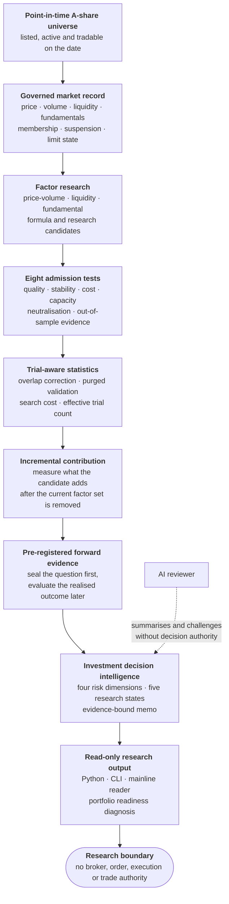

<div align="center">


**A rigorous A-share quantitative research system, from market data to investment decisions.**

*myQuant brings point-in-time data, factor validation, forward evidence and
deterministic risk assessment into one reproducible research workflow.*

[](https://www.python.org)
[](pyproject.toml)
[](LICENSE)

**English** · [简体中文](README.zh-CN.md)

[Advantages](#what-myquant-is-good-at) · [Workflow](#from-the-full-market-to-a-decision) ·
[Capabilities](#core-capabilities) · [Evidence](#evidence-from-self-audit) ·
[Scope](#current-scope) · [Run](#running-it)

</div>

---

## What myQuant is good at

myQuant helps a researcher move from a broad A-share market to a small set of
defensible conclusions. It keeps the data date, investable universe, factor
definition, validation path, forward evidence and decision rationale connected,
so another researcher can replay the work and challenge the result.

| Advantage | How it works | What you gain |
|---|---|---|
| **Time-consistent research** | Prices, fundamentals, membership and tradability are bound to when they became knowable | Backtests and reviews use the information available on the decision date |
| **Full-market factor evaluation** | Price, volume, liquidity, fundamental and formula candidates are measured on a governed A-share panel | One research process can compare ideas across the same universe and calendar |
| **Eight independent admission tests** | Data safety, coverage, predictive value, group returns, cost, neutralisation, out-of-sample stability and portfolio contribution are checked separately | A strong headline metric cannot hide a weak or missing part of the case |
| **Trial-aware statistics** | The pipeline corrects overlapping return windows, repeated searches and correlated variants | The best result must beat the cost of finding it |
| **Incremental alpha as the objective** | Candidate factors are compared with the factors already in the set | The system rewards new information instead of another version of the same exposure |
| **Forward evidence before maturity** | A candidate is declared and sealed before its outcome exists | Historical fit cannot quietly become prospective proof |
| **Reviewable investment decisions** | Four risk dimensions, five research states and a deterministic memo bind each conclusion to validated evidence | A reviewer can see what passed, what failed and what remains unknown |
| **Controlled AI assistance** | Models may summarise, extract and challenge evidence; deterministic policies keep decision authority | AI adds research capacity without changing scores, thresholds, weights or states |

The result is a research system that can explain both a positive conclusion and
a refusal. Missing evidence produces a named blocker, not a substitute value.

## From the full market to a decision

The workflow starts with the point-in-time A-share universe and narrows it through
data, factor, statistical and decision checks. Each stage preserves the exact
inputs needed to reproduce the next one.


```mermaid
flowchart TD
    U["<b>Point-in-time A-share universe</b><br/>listed, active and tradable on the date"]
    D["<b>Governed market record</b><br/>price · volume · liquidity · fundamentals<br/>membership · suspension · limit state"]
    F["<b>Factor research</b><br/>price-volume · liquidity · fundamental<br/>formula and research candidates"]
    G["<b>Eight admission tests</b><br/>quality · stability · cost · capacity<br/>neutralisation · out-of-sample evidence"]
    T["<b>Trial-aware statistics</b><br/>overlap correction · purged validation<br/>search cost · effective trial count"]
    I["<b>Incremental contribution</b><br/>measure what the candidate adds<br/>after the current factor set is removed"]
    W["<b>Pre-registered forward evidence</b><br/>seal the question first,<br/>evaluate the realised outcome later"]
    J["<b>Investment decision intelligence</b><br/>four risk dimensions · five research states<br/>evidence-bound memo"]
    O["<b>Read-only research output</b><br/>Python · CLI · mainline reader<br/>portfolio readiness diagnosis"]
    Z(["<b>Research boundary</b><br/>no broker, order, execution or trade authority"])

    U --> D --> F --> G --> T --> I --> W --> J --> O --> Z

    LLM["AI reviewer"] -. "summarises and challenges<br/>without decision authority" .-> J
```

The same time-consistent data supports factor comparison across the market. Every
conclusion that reaches the end carries enough evidence for an independent review,
and unresolved uncertainty remains visible in the result.

## Core capabilities

### Point-in-time A-share data foundation

The CN data layer uses canonical Parquet snapshots and explicit pointers for
market, membership and fundamental data. It keeps trading-calendar coverage,
suspension, ST and limit-board state separate from observed prices. Fundamental
and exposure data carry their source and effective date, which allows a research
run to reconstruct what was knowable at its cutoff.

Maintenance and validation are separate operations. A data update can advance a
snapshot only after its own checks pass; a reader does not silently replace a
missing or invalid source with CSV, cached or inferred data.

### Factor research with governed admission

myQuant evaluates factor candidates from price, volume, liquidity, fundamentals
and formula families on a common full-market panel. The governance layer asks
eight separate questions before a candidate can advance:

1. Were all inputs knowable on the evaluation date?
2. Is coverage broad and stable across the market?
3. Is cross-sectional predictive value persistent?
4. Are ranked group returns directionally coherent?
5. Does the effect survive turnover, cost and capacity pressure?
6. Does it remain after sector and size neutralisation?
7. Does it hold across purged out-of-sample paths and nearby parameters?
8. Does it improve the existing factor set rather than duplicate it?

Unknown evidence fails the relevant test. That rule keeps a high ICIR or an
attractive equity curve from overriding missing data, unrealistic capacity or
redundant exposure.

### Statistics that account for the research process

The validation layer measures more than one backtest path:

- combinatorial purged cross-validation separates overlapping labels;
- non-overlapping cohorts and Newey-West-style corrections address inflated
  significance from forward-return windows;
- deflated performance statistics and probability-of-overfitting diagnostics
  charge the result for the number of candidates searched;
- correlation-based effective trial counts identify parameter variants that
  represent the same underlying bet;
- residualised IC and portfolio-increment tests rank candidates by new
  information, not standalone strength alone.

These checks make the research budget visible. A wider search raises the burden
of proof instead of increasing the chance that a lucky winner is accepted.

### Pre-registration and forward evidence

Forward research starts from an explicit request whose bytes and SHA-256 are
sealed before the outcome exists. Later evaluation binds the realised outcome
to that request and produces immutable receipts. Shadow and Forward sessions can
accumulate evidence without changing the public mainline or granting production
authority.

This separation lets a historical backtest support a hypothesis while reserving
maturity for evidence that did not exist when the hypothesis was declared.

### Deterministic decision intelligence

The I1 decision library replays an exact research closure, assesses risk across
`BUSINESS`, `FINANCIAL`, `MARKET` and `THESIS`, and returns one of five states:

| State | Research meaning |
|---|---|
| `THESIS_INVALIDATED` | A pre-registered forward hypothesis failed |
| `INSUFFICIENT_EVIDENCE` | A required evidence class or risk dimension is unavailable |
| `WATCHLIST` | The evidence exists, but a confidence, posterior, risk or veto gate did not pass |
| `RESEARCH_APPROVED` | Research gates passed; a stricter paper-review requirement remains open |
| `PAPER_CANDIDATE` | The case is eligible for a separately governed external paper review |

The memo can quote validated hypotheses, evidence, risks and allowlisted research
notes. It cannot invent a score, a target price or an action. This makes the
decision readable without weakening the evidence chain behind it.

### Read-only public and readiness surfaces

The public `QuantInvestor` Python API and the `research run`, `market analyze`
and `market run` commands resolve one exact V17 active pointer. They never scan
for the newest result or build a replacement. `portfolio cycle-status` checks
explicit strategy, holdings and policy inputs without writing a portfolio.

These surfaces let operators consume a governed result and diagnose missing
inputs while keeping publication, activation and portfolio mutation separate.
Every exposed result is a read-only public run; none of these commands builds or
activates a replacement.

## Why researchers use this design

| Research need | myQuant default |
|---|---|
| Compare many ideas fairly | Use one universe, calendar, cost model and evidence vocabulary |
| Avoid look-ahead and survivorship | Bind market and fundamental observations to their actual availability |
| Control factor-zoo risk | Count searches, cluster correlated variants and raise the statistical hurdle |
| Build a diversified factor set | Measure residual contribution after removing current exposures |
| Separate history from proof | Pre-register the question and wait for the forward outcome |
| Explain a conclusion | Emit named states, blockers, evidence references and a deterministic memo |
| Add model assistance safely | Restrict AI to advisory text while deterministic controls decide |
| Reproduce a result | Bind canonical artifacts, exact paths and hashes through the research chain |

## Evidence from self-audit

The system has already changed conclusions about its own earlier research:

- **Two of five previously admitted factors lost statistical significance**
  after their overlapping return windows were corrected.
- **Zero of 230 candidates cleared the search-cost bar** in a full mining run.
  The result redirected research toward a narrower, theory-led search rather
  than a larger enumeration.
- **The highest standalone candidate duplicated an existing exposure.** Ranking
  by incremental contribution moved it down and surfaced a less redundant lead.
- **A reconstructed market-cap field affected roughly one quarter of values.**
  Point-in-time source validation found the issue and removed the field from the
  governed path.

Each finding stopped weak evidence from entering the factor set. Current admission
standards remain unchanged when a run produces no qualified candidate.

## Current scope

myQuant currently supports CN A-shares and research-only decision workflows.

**Available in the repository:** canonical market and fundamental maintenance,
strict storage validation, factor research and governance, trial-aware
statistics, forward-evidence and Shadow tooling, the deterministic I1 decision
library, read-only public V17 readers, portfolio-readiness diagnostics and a
read-only dashboard surface.

**Outside the current public authority:** a governed production publisher,
active-pointer activation CLI, automatic live portfolio construction, paper
ledger, broker connection, order creation, execution and trading. A research
state such as `PAPER_CANDIDATE` never implies a market action.

## Running it

```bash
uv sync
cp .env.example .env
quant-investor --help
quant-investor-v17-v4 --help
```

Local work is offline by default. Inspect the exact command contract before a
run:

```bash
quant-investor market maintain --help
quant-investor market storage-validate --help
quant-investor research run --help
quant-investor portfolio cycle-status --help
quant-investor-v17-v4 run-forward --help
quant-investor-v17-v4 research-evaluate --help
```

Python 3.13+. The local equivalent of CI:

```bash
uv run pytest tests/unit -q
uv run flake8 quant_investor --count --select=E9,F63,F7,F82 --show-source --statistics
uv run mypy quant_investor/factors --ignore-missing-imports
```

## Documentation

Start with [Factor mining mechanism](docs/factor_mining_mechanism.md) for the
research diagnosis behind the statistical and set-level design.

- [Documentation index](docs/README.md)
- [Factor Governance v4](docs/factor_governance_v4.md)
- [Research pipeline and protocols](docs/architecture/research_pipeline_and_protocols.md)
- [V17 v4 mainline contract](docs/architecture/v17_v4_production_research_contract.md)
- [I0 Investment Intelligence](docs/architecture/v17_i0_investment_intelligence.md)
- [R2.2 Forward Research Evaluator](docs/architecture/v17_r22_forward_research_evaluator.md)
- [I1 Investment Decision Intelligence](docs/architecture/v17_i1_investment_decision_intelligence.md)
- [Tushare 10,000 investment-intelligence flow](docs/architecture/tushare_10000_investment_intelligence.md)
- [Portfolio-cycle foundation](docs/architecture/v17_portfolio_cycle_foundation.md)
- [Tushare data cleaning](docs/tushare_data_cleaning.md)
- [Trading discipline](docs/trading_discipline.md)
- [V17 v4 operations](docs/runbooks/v17_v4_operations.md)
- [Agent guide](AGENTS.md)

The statistical design follows Harvey, Liu and Zhu on significance hurdles;
Bailey and López de Prado on selection bias and backtest overfitting; purged
combinatorial cross-validation for overlapping labels; and AlphaGen and
AlphaForge on set-level objectives. Full citations are in the factor-mining
note.

## License

[MIT](LICENSE) © 2024 alpha-mw
