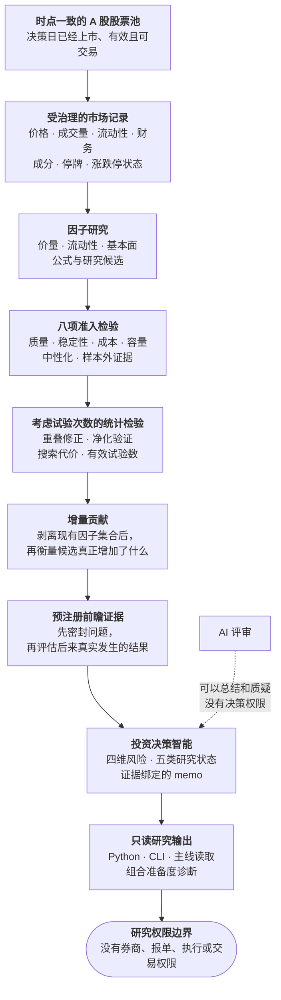

<div align="center">


**一套从市场数据走到投资判断的严谨 A 股量化研究系统。**

*myQuant 把时点数据、因子验证、前瞻证据和确定性风险评估放进同一条可复现的研究流程。*

[](https://www.python.org)
[](pyproject.toml)
[](LICENSE)

[English](README.md) · **简体中文**

[核心优势](#myquant-擅长什么) · [研究流程](#从全市场走到投资判断) ·
[功能](#核心功能) · [实证](#系统自查产生的证据) ·
[范围](#当前范围) · [运行](#运行)

</div>

---

## myQuant 擅长什么

myQuant 帮助研究者把广阔的 A 股市场收敛成少量有证据支撑的结论。数据日期、可投资股票池、
因子定义、验证路径、前瞻证据和决策理由都在同一条链上，另一位研究者可以复现整个过程，
也可以直接质疑其中任何一步。

| 优势 | 如何实现 | 带来的价值 |
|---|---|---|
| **时间一致的研究底座** | 价格、财务、成分和可交易状态都绑定到真正变得可知的时间 | 回测和复盘只使用决策日当时已经存在的信息 |
| **A 股全市场因子评估** | 在同一份受治理的 A 股面板上评估价量、流动性、基本面和公式因子 | 不同想法可以沿用同一股票池和交易日历公平比较 |
| **八项独立准入检验** | 分别检查数据安全、覆盖度、预测力、分组收益、成本、中性化、样本外稳定性和组合贡献 | 一个亮眼指标无法掩盖证据缺口或薄弱环节 |
| **考虑搜索代价的统计检验** | 修正重叠收益窗口、重复搜索和高度相关的参数变体 | 最好的结果必须先跨过「找到它」本身带来的统计门槛 |
| **以增量价值为目标** | 把候选因子与已有因子集合比较 | 奖励真正的新信息，而不是同一种暴露的另一个版本 |
| **先预注册，再等待前瞻证据** | 结果出现前先声明并密封候选 | 历史拟合不能悄悄变成前瞻证明 |
| **可以复核的投资判断** | 用四维风险、五类研究状态和确定性 memo 绑定结论与证据 | 评审者能看到通过项、失败项和仍然未知的部分 |
| **受约束的 AI 辅助** | 模型可以总结、提取和质疑证据，确定性策略保留决策权 | AI 扩大研究能力，但不能修改分数、阈值、权重或状态 |

系统既能解释正面结论，也能解释为什么暂时不能下结论。证据缺失时会返回具名阻断项，
不会拿替代值把流程继续跑完。

## 从全市场走到投资判断

研究从时点一致的 A 股股票池开始，依次经过数据、因子、统计和决策检查。每一步都保留复现
下一步所需的精确输入。



所有因子都在同一份时间一致的数据上比较。每个走到末端的结论都带有足够的证据供独立复核，
尚未解决的不确定性会继续留在结果里。

## 核心功能

### 时点一致的 A 股数据底座

CN 数据层使用规范 Parquet 快照和显式指针管理行情、股票池与基本面数据。交易日覆盖、停牌、
ST 和涨跌停状态与价格观测分别记录。基本面与暴露数据保留来源和生效日期，因此研究运行可以
还原在决策截止时间真正可知的信息。

数据维护和数据验证是两项独立操作。更新只有在自身检查通过后才能推进快照；读取端遇到缺失或
无效数据时，不会偷偷改用 CSV、缓存或推断值。

### 带准入治理的因子研究

myQuant 在统一的全市场面板上评估价量、流动性、基本面与公式因子。候选晋级前需要分别回答
八个问题：

1. 所有输入在评估日是否已经可知？
2. 覆盖是否足够广，并且在市场横截面上稳定？
3. 横截面预测能力是否持续存在？
4. 分组收益方向是否连贯？
5. 扣除换手、成本和容量压力后，效果是否还在？
6. 剥离行业和市值暴露后，效果是否还在？
7. 在净化样本外路径和邻近参数上是否稳定？
8. 加入现有因子集合后，是否真正改善组合？

未知证据会让对应检验失败。高 ICIR 或好看的净值曲线不能覆盖数据缺口、不现实的容量假设或
重复暴露。

### 把研究过程本身纳入统计检验

验证层不会只看一条回测路径：

- 组合式净化交叉验证隔离重叠标签；
- 非重叠样本组和 Newey-West 类修正处理前瞻收益窗口抬高显著性的问题；
- 经选择偏差修正的表现统计与过拟合概率诊断，会把搜索候选的数量计入门槛；
- 基于相关性的有效试验数，会识别本质上属于同一个想法的参数变体；
- 残差 IC 与组合增量检验按新增信息排序，而不是只看候选单独有多强。

这些检查让研究预算可见。搜索范围越宽，举证门槛越高，不会因为候选更多就更容易接受一个
幸运的赢家。

### 预注册与前瞻证据

前瞻研究从一份显式请求开始，请求内容和 SHA-256 在结果出现前密封。后续评估把真实结果绑定回
原始请求，并生成不可变回执。Shadow 与 Forward 会积累研究证据，但不会修改公开主线，也不会
获得生产权限。

历史回测可以支持一个假设；成熟度则需要依靠假设声明之后才产生的证据。两者在系统里有明确边界。

### 确定性的投资决策智能

I1 决策库重放一份精确的研究闭包，分别评估 `BUSINESS`、`FINANCIAL`、`MARKET` 和 `THESIS`
四类风险，并返回五类状态之一：

| 状态 | 研究含义 |
|---|---|
| `THESIS_INVALIDATED` | 预注册的前瞻假设已经失败 |
| `INSUFFICIENT_EVIDENCE` | 必需证据或风险维度仍不可用 |
| `WATCHLIST` | 证据已经存在，但置信度、后验、风险或否决条件未通过 |
| `RESEARCH_APPROVED` | 研究门槛通过，更严格的模拟评审要求仍未闭合 |
| `PAPER_CANDIDATE` | 具备提交到独立外部模拟评审的资格 |

memo 只能引用已经验证的假设、证据、风险和允许进入的研究笔记，不能编造分数、目标价或操作。
这样既能把结论写成人能读懂的内容，也不会削弱结论背后的证据链。

### 只读公开入口与准备度诊断

公开 `QuantInvestor` Python API，以及 `research run`、`market analyze` 和 `market run` 命令，
都会读取同一个精确的 V17 active pointer。它们不会扫描最新结果，也不会临时生成替代结果。
`portfolio cycle-status` 使用显式的策略、持仓和策略文件检查准备度，不会写入组合。

这些入口让使用者读取受治理的结果、定位缺失输入，同时把发布、激活和组合修改保持为不同权限。

## 这种设计适合解决什么问题

| 研究需求 | myQuant 的默认做法 |
|---|---|
| 公平比较大量想法 | 统一股票池、交易日历、成本模型和证据口径 |
| 避免前视与幸存者偏差 | 把行情和基本面观测绑定到真正可用的时间 |
| 控制因子动物园 | 统计搜索次数、聚类相关变体、提高显著性门槛 |
| 构建更分散的因子集合 | 剥离当前暴露后再衡量残差贡献 |
| 把历史表现与真正证明分开 | 先预注册问题，再等待前瞻结果 |
| 解释一个研究结论 | 输出具名状态、阻断项、证据引用和确定性 memo |
| 安全加入模型能力 | 把 AI 限制在文字评审层，确定性控制链负责决策 |
| 复现一次运行 | 用规范产物、精确路径和哈希绑定整条研究链 |

## 系统自查产生的证据

这套系统已经改变了对自身早期研究的判断：

- **此前准入的五个因子中，有两个在修正重叠收益窗口后失去统计显著性。**
- **一次全量挖掘的 230 个候选中，没有一个跨过搜索代价门槛。** 这个结果把后续研究引向更窄、
  更有理论依据的候选集，而不是继续扩大枚举规模。
- **单独得分最高的候选重复了已有暴露。** 改用增量贡献排序后，它的名次下降，一个冗余度更低的
  研究线索进入前列。
- **一个由重建而非观测得到的市值字段影响了约四分之一的取值。** 时点来源验证发现了问题，
  并把该字段移出受治理的数据路径。

每一项发现都阻止了薄弱证据进入因子集合。一次运行没有合格候选时，系统不会降低现有准入标准。

## 当前范围

myQuant 当前支持 CN A 股与研究型决策工作流。

**仓库内已经提供：** 规范行情与基本面维护、严格存储验证、因子研究与治理、考虑搜索代价的统计
检验、前瞻证据与 Shadow 工具、确定性 I1 决策库、只读 V17 公开读取、组合准备度诊断，以及
只读 dashboard 展示。

**当前公开权限之外：** 受治理的生产发布器、active pointer 激活 CLI、自动实盘组合构建、模拟盘
账本、券商连接、报单、执行与交易。`PAPER_CANDIDATE` 等研究状态不代表任何市场操作。

## 运行

```bash
uv sync
cp .env.example .env
quant-investor --help
quant-investor-v17-v4 --help
```

本地工作默认离线。运行前先查看精确命令契约：

```bash
quant-investor market maintain --help
quant-investor market storage-validate --help
quant-investor research run --help
quant-investor portfolio cycle-status --help
quant-investor-v17-v4 run-forward --help
```

需要 Python 3.13+。CI 的本地等价检查：

```bash
uv run pytest tests/unit -q
uv run flake8 quant_investor --count --select=E9,F63,F7,F82 --show-source --statistics
uv run mypy quant_investor/factors --ignore-missing-imports
```

## 文档

建议先读[因子挖掘机制](docs/factor_mining_mechanism.md)，了解统计检验和集合级目标背后的研究诊断。

- [文档索引](docs/README.md)
- [Factor Governance v4](docs/factor_governance_v4.md)
- [研究管线与协议](docs/architecture/research_pipeline_and_protocols.md)
- [V17 v4 主线契约](docs/architecture/v17_v4_production_research_contract.md)
- [I0 投资智能](docs/architecture/v17_i0_investment_intelligence.md)
- [R2.2 前瞻研究评估器](docs/architecture/v17_r22_forward_research_evaluator.md)
- [I1 投资决策智能](docs/architecture/v17_i1_investment_decision_intelligence.md)
- [组合周期基础](docs/architecture/v17_portfolio_cycle_foundation.md)
- [Tushare 数据清洗](docs/tushare_data_cleaning.md)
- [交易纪律](docs/trading_discipline.md)
- [V17 v4 运维](docs/runbooks/v17_v4_operations.md)
- [Agent 指南](AGENTS.md)

统计设计参考 Harvey、Liu 与 Zhu 的显著性门槛；Bailey 与 López de Prado 关于选择偏差和回测
过拟合的研究；针对重叠标签的组合式净化交叉验证；以及 AlphaGen 和 AlphaForge 的集合级目标。
完整引用见因子挖掘机制文档。

## 许可证

[MIT](LICENSE) © 2024 alpha-mw
