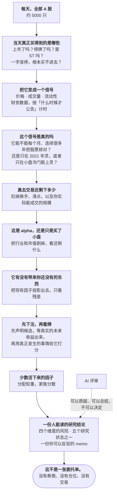

<div align="center">


**一个以「准入证据」而非「回测曲线」为核心的 A 股因子研究系统。**

*产生信号很便宜。在付清点位数据、重叠标签和自己搜索规模的代价之后，
还能判断哪一个是真的——这才是全部的工作。*

[](https://www.python.org)
[](pyproject.toml)
[](LICENSE)

[English](README.md) · **简体中文**

[为什么](#为什么要做这个项目) · [怎么研究 A 股](#它是怎么研究-a-股的) ·
[因子准入](#核心因子准入机器) · [数据底座](#它所依赖的数据底座) ·
[与回测框架的差别](#与回测框架的差别) · [如何运行](#如何运行) ·
[当前状态](#当前状态)

</div>

---

## 为什么要做这个项目

任何量化项目都能产生信号。在价量和基本面上枚举 `family × window`，一个下午就有几百个
候选；按 IC 排序，留下前五个，画出净值曲线——它永远好看。

这就是陷阱，而且它不是工程问题，是测量问题。它有四个互相独立、又都会悄悄抬高结果的部分：

1. **标签自己和自己重叠。** 日频 RankIC 对 30 个交易日的前瞻收益，与前后 29 个观测共享
   同一个标签窗口。对这样的序列做朴素的 iid t 检验，显著性大约被放大 `√30` 倍。在本仓库
   自己的五个"生产因子"上实测：用 Newey-West（lag 30）或非重叠 30 交易日队列均值修正之后，
   **五个里有两个不再显著**。而它们此前都是"8/8 全过"。
2. **搜索本身是要付费的。** 即使 230 个候选全是噪声，其中最大的那个 ICIR 也是向上有偏的。
   把冠军的未修正统计量当作结论汇报，正是因子动物园的标准造法。
3. **点位数据不是默认的，是要做出来的。** 财报会被追溯调整，成分会变；用一个 as-of 的
   `total_share` 快照乘以收盘价重建出来的市值列，是一个披着合理外衣的前视泄漏——本仓库
   曾经就这样跑了好几个月而没有察觉。
4. **候选其实全是同一个候选。** 在 2026-08-01 那次运行中，230 个候选里只有 9 个组合增量
   为正，而这 9 个与已持有因子的相关性全部在 0.81–1.00 之间。整个搜索预算都花在用略微不同的
   窗口重新发现 `low_dollar_volume` 上。

这四件事都不会抛异常，它们只会返回一个看上去合理的数字。所以这个仓库不是围绕"产生收益"
组织的，它围绕**产生一个站得住脚的因子准入判断**组织，并且在证据缺失时拒绝给出判断。

> 交付物不是净值曲线，而是这样一句话：*"这个因子可以准入，支持它的每一份证据在这里，
> 每一份证据的哈希也在这里"*——或者，一个明确命名的 blocker。

## 它是怎么研究 A 股的

整个系统就是一个漏斗：从全部 A 股开始，每一步都扔掉说不清楚的那部分。绝大多数东西都会被
扔掉——这是设计在生效，不是在失败。



关于这个漏斗，有两件事值得挑明。

**最窄的地方在中间，不在两头。** 大多数量化项目把力气花在顶端（更多数据、更多候选）和底端
（更好的优化器）。这个项目把力气花在中间那四个问题上，因为一个"看上去合理的数字"正是在
那里变成一个错误的数字。

**最后那根箭头是一堵墙。** 一个走完整个漏斗的因子，产出的是研究结论，不是仓位。把研究变成
真实组合是一个独立的、**刻意没有建**的步骤——所以这个仓库里没有任何东西能悄悄地从"有意思"
毕业成"已成交"。

## 核心：因子准入机器

### 八道 Gate

`quant_investor/factors/governance.py` 用八个互相独立的问题给每个候选打分。**未知证据一律
按失败处理**——没有证据生产者的 Gate 会 fail closed，而不是按假设放行。

| Gate | 问的问题 | 代表性阈值 |
|---|---|---|
| 1 · 数据安全 | 每一个输入在调仓日当天是否真的可知？ | 逐候选的版本化 PIT / 可交易性审计 |
| 2 · 覆盖与稳定性 | 信号是广泛定义的，还是集中在某个角落？ | 覆盖率 ≥ 60%，NaN ≤ 40%，单一行业或规模桶不超过 80% |
| 3 · IC / RankIC | 截面上的边际是真的且持续的吗？ | \|ICIR\| ≥ 0.30，正 IC 比例 ≥ 0.52，RankIC 方向稳定，单年贡献 ≤ 60%，家族 BH q ≤ 0.10 |
| 4 · 分组收益 | 多空价差是否单调？ | 单调性 ≥ 0.35，价差与首组收益为正 |
| 5 · 成本与换手 | 这个边际能扛住被交易吗？ | 年换手 ≤ 12 倍，容量压力 ≤ 0.75，成本调整后收益为正 |
| 6 · 中性化与暴露 | 是 alpha，还是被重新包装的规模/行业赌注？ | 中性化后 \|ICIR\| ≥ 0.20，与现有池相关性 ≤ 0.70，显式 `style_exposure_only` 标记 |
| 7 · 样本外与稳健性 | 在被发现的样本之外还成立吗？ | purge + embargo 的 CPCV 正路径比例 ≥ 0.55 |
| 8 · 组合增量 | 加进去能改善**组合**吗？ | 收益与夏普增量为正，回撤增量 ≤ 2%，换手增量 ≤ 30%，A/B/C/D replay 逐臂哈希 |

八道全过是**必要而不充分**的。要成为 *production candidate*，还需要 `|ICIR| ≥ 0.50`、
正 IC 比例 ≥ 0.55，以及一条真实的成熟度路径：12 个互异的实际月末 RankIC session，或者
8 个由 30 个连续开市日构成的非重叠队列，且必须取自严格 Parquet 绑定的精确日历。独立的
90 天诊断、周末算术，或调用方自己声明的持有期，都不具备权威性。

随后的集合级政策做了一件大多数因子库从不强制的事：在每因子 20%、每家族 35% 的绝对权重
上限下，五因子基线**在数学上必然要求五个不同的 family**。家族多样性不再是偏好，而是一个
算术约束。

Gate 之上还有三层。

### 重叠标签：组合式净化交叉验证

当标签窗口有 30 个交易日宽时，连续切分的训练/测试折会双向泄漏——这正是此前的样本外诊断
能给出 positive ratio = 1.0，而这些因子却经不起诚实修正的原因。

`quant_investor/factors/purged_cv.py` 把交易日历切成 10 个 block，在全部 `C(10,2) = 45` 个
block 对上测试。每次切分都会 **purge** 掉标签窗口伸进测试块的训练日，并对每个测试块之后
紧接的 30 个交易日做 **embargo**。purge 和 embargo 按**交易日**而不是自然日计数，所以
Gate 7 要求的 30 天是字面意义上的 30 天。产出是 45 条回测路径而不是一条——这正是下面的
统计量所需要的输入。

代码里记录并被下游遵守的一个警告：这 45 条路径高度重叠（每个 block 出现在其中 9 条里），
所以路径比例是**必要而不充分**的；纯噪声在单次抽样上也能过 0.55。

### 为搜索规模付费

`quant_investor/factors/trial_correction.py` 是绝大多数个人量化项目会直接跳过的那一层。

- **通缩夏普比率（Deflated Sharpe，Bailey & López de Prado）。** 运行会记录自己评估了多少个
  候选、这些候选的 ICIR 离散度有多大，算出 N 个"毫无价值的试验"中最好的那个在零假设下期望
  能达到的 ICIR，再据此对观测 ICIR 进行通缩，并调整偏度、峰度与序列长度。因为这里做夏普的
  "收益序列"就是逐次调仓的 RankIC 序列，它的夏普**就是**流水线已经在报的 ICIR。下限 0.95。
- **回测过拟合概率（PBO）。** 对整个候选集做组合对称交叉验证：10 个时间块、全部 252 种
  样本内/样本外均衡切分，提名样本内冠军，再问它在样本外排第几。上限 0.5。
- **非重叠队列 t 统计量**，对标 Harvey、Liu 与 Zhu 的 **t > 3.0** 门槛，而不是惯用的 2.0。
  队列宽度恰好等于一个持有期，所以重叠是被**移除**而不是被建模。
- **有效试验数。** 同一个想法的七十个平滑变体是一个假设，不是七十个。候选按 IC 序列的绝对
  相关性聚类（用的就是冗余 Gate 那个 0.70 的门槛），通缩夏普按**簇数**而不是原始候选数收费。

这些修正严格是**额外的一道栏**：修正层不能让任何被 Gate 拒绝的候选重新合格。

### 目标函数是集合级的，不是单独的

`quant_investor/factors/incremental_alpha.py` 逐个截面地把现有生产因子池从候选中投影出去，
两边先做排序，所以投影是尺度无关的。排序依据随之变成：先看 Gate 分数，再看**残差化后的**
ICIR，独立 ICIR 降级为并列时的 tie-break。

这就把"冗余"从 Gate 8 的一次晚期否决，变成了搜索本身要优化的对象。在真实数据上的效果并不
微妙：

| 候选 | 独立 RankIC | 残差 RankIC | 保留率 | 与池相关性 |
|---|---|---|---|---|
| `pv_low_dollar_volume_5d` | 0.1206 | 0.0112 | 0.47 | 1.00 |
| `pv_low_dollar_volume_10d` | 0.1189 | 0.0135 | 0.25 | 0.98 |
| `pv_low_dollar_volume_20d` | 0.1124 | 0.0036 | 0.06 | 0.95 |

整轮运行中独立 RankIC 最高的那个候选，本来就已经在生产里，残差化之后掉到 230 名中的第 95 位。
顶上来的是更有意思的东西：`fund_fin_ocf_to_profit` 的保留率高于 1.0——因为原有池此前在
**反向**对抗它——而五因子基线在数学上恰恰要求家族多样性。独立排序把它埋掉了。

### 这台机器现在的结论

这一节是整篇 README 值得被信任的原因。

运行 `factor_v4_mining_20260805_stage3`，230 个候选，2021-08 至 2026-06：

| | 数值 |
|---|---|
| 最高 Gate 分数 | 5 / 8 |
| 通过 `t > 3.0` 的候选 | 94 / 230 |
| PBO | 0.048 —— 排序是**稳定**的 |
| 实际观测到的最佳 ICIR | 0.724 |
| 零假设下 230 次试验的期望最佳 ICIR | 1.067 |
| 通过 DSR ≥ 0.95 的候选 | **0 / 230** |

把最后三行放在一起读，这是一个**有方向的发现**而不是一句简单的否决：选择过程没有在拟合噪声，
但对于这么宽的一次搜索来说，效应量太小了。它说明出路**不是**枚举更多候选——搜索越大，每个
候选要跨过的栏就越高——而是用预注册把试验数降下来，或者去找更大的效应。

Gate 1、5、8 至今没有证据生产者，因此持续 fail closed。**当前没有任何候选是可准入的，
仓库选择如实说出这一点，而不是去调低某个阈值。** 完整诊断、结论对有效 N 区间的敏感性，
以及排好序的后续计划，见 [因子挖掘机制](docs/factor_mining_mechanism.md)。

### 治理 v5：预注册，以及一个无权准入的回测通道

上面 v4 得出的结论——*别再枚举了，把试验数降下来*——是一条建议，而建议会衰减。
`quant_investor/factors/governance_v5/` 把它变成了一个回溯结果绕不过去的协议。

v5 里的一切都是密封的、按内容寻址的、可精确复放的 receipt，而每一份 receipt 都声明自己的
**lane（通道）**：

| 通道 | Receipt | 能准入一个因子吗？ |
|---|---|---|
| `PROSPECTIVE_ONLY` | 前瞻评估 | **能** —— 唯一能的通道 |
| `BACKTEST_SUPPORT_ONLY` | 历史支持投影 | 不能 —— 自带 `admission_eligible: false` |
| `DIAGNOSTIC_ONLY` | 诊断扫描 | 不能 —— 自带 `promotion_eligible: false`，用途写死为*仅用于下一周期的预注册提名* |

这张表就是全部论点。回测可以支持一个判断，但永远不能了结它。对历史面板的一次扫描，最多
只能挣到*为下一周期的预注册提名一个候选*的资格。

预注册本身是按临床试验协议的方式强制的，不是按注释的方式：

- **在结果存在之前密封。** `build_preregistration` 会拒绝任何 `label_available_at` 不严格
  晚于密封时间的文档，并记录 `sealed_before_label_available: true`。你必须在标签还不可知的
  时候就锁定候选清单。
- **评估被绑定到声明上。** 候选不在预注册里的前瞻评估是契约错误；日期早于标签可得时间的
  评估同样是错误。
- **覆盖率的判断必须在标签开放之前关闭。** coverage receipt 必须在 cutoff 之后、并且
  **严格早于** `label_reader_permitted_at` 计算——所以"这个输入太稀疏了"永远不可能是看到
  因子表现之后才下的判断。
- **替换是预先声明的应急预案。** 替换一个候选，要求主候选的 coverage 为 `FAILED`、备选为
  `PASSED`，且备选必须在密封文档里就被声明为 `ALTERNATE_FOR:<primary>`，并且发生在标签
  reader 开放之前。不存在事后替换。
- **校验是复放，不是校验哈希。** 每个 validator 都会从输入重新构建文档并要求逐字节一致。
  把改过的 artifact 重新封印，是过不去的。

准入之后的权重是**推导**出来的而不是选出来的：purged 样本外收缩 + 最大余数法分配，用精确
`Decimal` 计算，并校验总和恰好为 1。

代价是显式的，而且这正是要点。**在 v5 之下，准入一个因子要付出一个真实的持有期**——你必须
先声明它，等标签出来，再在预注册为你换来的那些路径上评估。这比挖掘慢得多，但它也是这条
流水线唯一一个"通过"就真的等于字面意思的版本。

## 它所依赖的数据底座

上面所有统计量，在会泄漏的数据上都毫无意义。规范存储是严格 CN Parquet，并且：

- **点位成分。** `cn_pit_universe` 记录每一天谁在上市、谁可投资，带 generation 血缘与 manifest，
  universe 是被**重建**出来的，而不是被假设出来的。
- **受治理的 fundamental generation。** 每一行都带 `availability_date`；行业与市值从该 generation
  读取，并与其 manifest 哈希绑定。此前的加载器有 27% 的市值是由单个 as-of 股本快照重建的——
  那条路径已经删掉。
- **规模桶用截面三分位**，而不是固定绝对阈值。在绝对阈值下，一轮上涨会把整个截面扫进 `large`，
  中性化会悄无声息地不再剥离任何规模暴露。
- **A 股微观结构进入审计路径。** 停牌、涨停（买入受阻）、跌停（卖出受阻）和 ST 状态是一等
  可交易性字段，而不是成交假设脚注里的一句话。
- **不做隐式替换。** 缺失的 Parquet 分区不会变成 CSV、变成过期快照、或者变成推断值。维护是
  显式的操作员工作流；分析类命令不会在你背后发起 provider 调用去补数据。
- **理由编码的覆盖区间。** fundamental mart 里的一个空洞不是一个裸 NaN。覆盖边界会被显式
  声明并带理由校验，所以"还没到披露时点""停牌""我们压根没取过"这三种情况始终可区分——
  正是这个区分决定了一次 Gate 2 覆盖率失败到底是关于这只股票的事实，还是关于流水线的事实。
- **停牌感知的历史。** 停牌股不会被静默前向填充成一个"可交易观测"，历史构建过程会带上停牌
  状态，供后面的可交易性审计读取。
- **有护栏的分级维护。** fundamental generation 先落 staging、校验、再按 expected pointer SHA
  原子晋升。历史回补（现已回到 2015 年）和不可能交易日的隔离都是独立、可复核的操作，而不是
  就地改写。
- **一切内容绑定。** manifest、快照与证据都携带 SHA-256 绑定，事后替换产物必然导致校验失败。

退市与二级来源证据在 `quant_investor/market/`；清洗契约见
[Tushare 数据清洗](docs/tushare_data_cleaning.md)。

## 因子之外

**Forward / Shadow 证据。** 研究观察只从精确的、内容绑定的请求产生，且只面向未来。一次完成的
Shadow session 不能推进 active pointer，也不能成为公开组合结果。

**I0 投资智能。** 确定性 Evidence 记录、贝叶斯似然诊断、三个独立的因果 Regime 层（Market、
Industry、Theme）、可得性感知的分支 Fusion、可证伪的 Hypothesis 与不可变 Memory。每个 Regime
层从显式输入出发只做**一步前向马尔可夫滤波**——没有后向平滑，没有隐藏历史搜索，没有持久化写入。
Regime 是**诊断**，不是仓位上限。

**R2.2 评估器。** `research-evaluate` 离线重放一个精确请求，向 stdout 输出一个规范信封。它可以
提出一个 Memory 追加提案，但不写入；不调用 provider，不改因子层级，不选组合，不碰 active pointer。

**I1 投资决策智能。** 一个 library-only 的层，把一次完整复放的研究闭包转成一份可复核的 memo
和一个有纪律的研究状态。它独立评估 `BUSINESS`、`FINANCIAL`、`MARKET`、`THESIS` 四个维度的
风险——不可得的维度会**显式保持不可得**，而不是默认成"没问题"——并按固定优先级返回五个状态
之一：

| 优先级 | 状态 | 含义 |
|---:|---|---|
| 1 | `THESIS_INVALIDATED` | 一个**预注册**的 R2.2 假设评估返回了 `FAILED` |
| 2 | `INSUFFICIENT_EVIDENCE` | 某个必需的可得性类别或风险维度不可得 |
| 3 | `WATCHLIST` | 输入齐备，但触发否决，或置信度/后验/风险闸门未过 |
| 4 | `RESEARCH_APPROVED` | 研究闸门通过，但更严格的 paper review 闸门未过 |
| 5 | `PAPER_CANDIDATE` | 研究与 paper review 闸门都通过 |

两个细节撑起了整个设计。只有**预注册**的假设失败才能证伪一个 thesis——一个事后补上的、看起来
像失败的假设只会返回 `UNCERTAIN`，不能证伪；这与治理 v5 的反事后规则是同一条，只不过作用在
叙事而不是因子上。以及，`PAPER_CANDIDATE` 就是天花板：它表示有资格进入外部 paper review，
不是选股、不是组合准入、不是仓位、不是目标价、不是 `BUY`/`SELL`/`HOLD`、不是委托、不是成交。
paper adapter 只是一个 `Protocol`，这个库从不实现也从不调用它。

memo 是一次**投影**，不是一个叙述者：它只能抄录已验证的假设、已采信的证据、已验证的风险理由、
context note，以及白名单内的 AI 草稿，仅此而已。缺失的"why now"会保持缺失，而不是被写成一段
通顺的文字。

**组合准备度。** `portfolio cycle-status` 校验显式提供的策略身份与持仓闭包，返回只读准备度文档。
它不会按目录顺序去"发现"当前持仓。准备度是一条**链**——身份、持仓、规范数据、因子状态、风险
政策、组合政策、发布、激活——验证其中一环，永远不授予其他环。

**LLM 只做评审，永不做决策。** 模型可以总结证据、挑战结论、起草假设；但它不能改动证据闭包、
候选集、风险限额、权重、pointer 或任何交易状态。"为什么是这个仓位"永远有一个确定性的答案。

## 与回测框架的差别

Qlib、backtrader、vectorbt、zipline 在回答*"这样做过去能赚多少"*上非常出色。这个仓库是为
*"我该不该相信它"*而建的——这两个问题需要**相反的默认值**。

| | 典型的回测优先项目 | 本仓库 |
|---|---|---|
| 交付物 | 净值曲线 + 因子排行 | 带哈希证据的准入结论，或一个命名的 blocker |
| 证据缺失时的默认 | 填默认值、告警、继续 | fail closed；该 Gate 记 0 分 |
| 多重检验 | 最后做一次家族 BH，甚至不做 | DSR、PBO、有效 N、t > 3.0 作为准入栏 |
| 预注册 | 没有；候选清单就是脚本枚举出来的那些 | 在标签存在之前密封；未注册的候选无法被评估 |
| 一次回测能得出什么结论 | 全部——它**就是**决策 | 什么都不能。`BACKTEST_SUPPORT_ONLY` 只能支持论证、提名下一周期的候选 |
| 标签重叠 | 忽略，对日频 IC 做 iid t 检验 | 按交易日计数的 purge/embargo CPCV + 非重叠队列 t 检验 |
| 搜索目标 | 独立 IC / ICIR | 对生产池的残差——冗余是排序要优化的对象 |
| 点位数据 | 加载器里的一个约定 | 由 generation 存储、`availability_date` 与 manifest 哈希强制 |
| 冗余 | 晚期否决 | 一等目标函数，并作为有效试验数的输入 |
| 研究 → 生产 | 同一个脚本；回测好看就是决策 | 分离的 schema 与存储家族；激活是独立的受治理契约 |
| LLM | 有时进入决策路径 | 仅建议，结构性地被排除在候选、限额与权重之外 |
| 负面结果 | 不发布 | 发布、标注日期，并留在 README 里 |

代价是诚实的：这个系统**更慢地说"是"**，会挡下一个宽松流水线本会去交易的因子。这是刻意的
不对称。在一个"同样的重叠标签错误会让本该通过三个的因子通过五个"的市场上，昂贵的错误不是
错过的那一个。

## 它要防住的失败

| 经典失败 | 机制 |
|---|---|
| **前视 / 幸存者偏差** | PIT 成分、逐行 `availability_date`、显式 cutoff、可得性感知的证据契约 |
| **数据静默替换** | 严格规范 Parquet、哈希绑定 manifest、无 CSV / latest-file 回退 |
| **重叠标签的假显著** | RankIC 的 Newey-West 与非重叠队列；按交易日 purge/embargo 的 CPCV |
| **回测过拟合** | 通缩夏普、PBO、有效试验数、Harvey t > 3.0 |
| **把事后诸葛亮包装成假设** | v5 预注册在标签存在前密封；只允许预先声明的替换；只有预注册的失败假设才能证伪 I1 的 thesis |
| **把研究批准当成一笔交易** | I1 的五个显式研究状态；即使 `PAPER_CANDIDATE` 也只授予外部 paper review 资格 |
| **因子动物园 / 冗余** | 池残差目标、0.70 相关性上限、家族 BH q ≤ 0.10、家族多样性要求 |
| **把风格赌注当 alpha 卖** | 基于 PIT 暴露的行业 × 规模中性化、显式 `style_exposure_only`、三分位而非绝对阈值 |
| **纸面 alpha 无法成交** | 换手与容量 Gate、成本调整收益、停牌 / 涨跌停 / ST 可交易性审计 |
| **非因果的 regime 分析** | 每层只做一步前向马尔可夫，无后向平滑与隐藏历史 |
| **把研究当成生产** | Shadow、I0/R2.2、因子证据与公开主线各自独立的 schema 与存储家族 |
| **模型输出变成决策** | LLM 仅建议；候选、限额、权重只能来自确定性契约 |
| **把代码合并当成激活** | 部署状态与 active pointer 状态分别检查、分别汇报 |
| **组合输入靠旧文件推断** | 显式身份与持仓引用；不做 newest-by-time 发现 |

## 如何运行

### 1. 维护规范市场数据

```bash
quant-investor market maintain --market CN --staged
quant-investor market storage-validate --market CN
quant-investor market fundamental-maintain --market CN --universes hs300,zz500,zz1000
```

Provider 访问是独立的，需要显式操作员授权。存储校验成功只证明它跑过的那些检查，它本身不是
一个投资决策。

### 2. 读取已激活的 V17 结果

以下兼容命令解析同一个精确 strategy pointer，返回同一条只读权威链：

```bash
quant-investor research run \
  --workspace-root /absolute/path/to/myQuant \
  --strategy-id <strategy-id>

quant-investor market analyze --workspace-root /absolute/path/to/myQuant --strategy-id <strategy-id>
quant-investor market run     --workspace-root /absolute/path/to/myQuant --strategy-id <strategy-id>
```

预期的显式状态——每一个都指出缺什么，而不是拿别的结果顶上：

| 条件 | 结果 | 写入 |
|---|---|---:|
| active pointer 缺失 | `V17_MAINLINE_UNINITIALIZED` | 0 |
| pointer / run / closure 无效 | `V17_MAINLINE_BLOCKED:<blocker>` | 0 |
| 市场不是 CN | `V17_MARKET_UNSUPPORTED` | 0 |
| 主线回测请求 | `V17_BACKTEST_UNAVAILABLE` | 0 |

### 3. 累积 Forward / Shadow 证据

```bash
quant-investor-v17-v4 run-forward \
  --workspace-root /absolute/path/to/myQuant \
  --request-path data/private/v17_v4_runs/forward_requests/<request_id>.json \
  --request-sha256 <exact-byte-sha256>
```

### 4. 评估成熟研究证据

```bash
quant-investor-v17-v4 research-evaluate \
  --workspace-root /absolute/path/to/myQuant \
  --request-path data/private/research_intelligence/evaluation_requests/forward-evaluation-request-<sha256>.json \
  --request-sha256 <exact-byte-sha256>
```

离线，且只写 stdout。

### 5. 构建一次复放的 I1 研究决策

I1 刻意是一个 Python 库而不是公开命令——这么有分量的决策不该被一行 shell 触达。调用方需要
提供完整的 I0 复放闭包，并可以绑定一个精确的 R2.2 请求；库据此推导 Context、Risk、Decision、
Memo 与 Discipline，不落盘，也不发起任何外部调用：

```python
from quant_investor.intelligence.decision import (
    assess_investment_risk,
    build_investment_memo,
    collect_investment_decision_context,
    make_investment_decision,
)
```

通过更严格的 paper review 闸门会得到 `PAPER_CANDIDATE`，它允许构造一个最小的
`PENDING_EXTERNAL_REVIEW` 提案，交给一个单独受治理的外部流程——除此之外什么也不允许。

### 6. 诊断组合周期输入

```bash
quant-investor portfolio cycle-status --help
```

需要显式规范路径、精确 SHA-256 绑定和一个决策 cutoff。

## 当前状态

仅 CN。没有券商、报单、执行或交易权限。

**已实现：**

- 八道 Gate 的因子评估器，含 CPCV、试验数修正、有效 N 聚类与池残差排序目标；
- 治理 v5：密封预注册、仅前瞻准入、覆盖与替换 receipt、确定性收缩权重，隔离在
  `quant_investor/factors/governance_v5/`；
- PIT universe、带理由编码覆盖区间与停牌感知历史的受治理 fundamental generation、
  有护栏的 staging/晋升、严格 Parquet 维护与存储校验；
- 精确 active-pointer 校验与只读公开投影（Python / CLI / Dashboard）；
- 显式的 V4 Forward / Shadow 观察；
- 确定性 I0 投资智能与 R2.2 评估；
- library-only 的 I1 投资决策智能：精确 I0 / 可选 R2.2 复放、四维风险、五个研究状态、
  确定性 memo 与只追加的决策纪律链；
- 只读的组合身份、持仓与准备度诊断。

**尚未作为公开操作工作流实现：**

- v4 Gate 1、5、8 的证据生产者——因此 v4 因子准入目前按设计处于阻断状态；
- 表达式空间上的搜索（求值器 `aquant_expression.py` 与 `aquant_expression_v5.py` 已存在，
  搜索没有）；
- 端到端的 decision-run 生产者、生产发布器或激活命令；
- 公开的 I1 CLI、Web 路由、调度器、持久化/Memory 写入器，或 paper adapter 的任何实现——
  I1 是一个库，adapter 是一个它从不调用的接口；
- I0/R2.2 的自动调度器或请求生成器；
- 组合周期生产者、纸面账本写入器或学习编排器；
- 券商、报单、执行或交易对接。

两份清单之间的差距是刻意的，而且被记录下来而不是被粉饰。在评估还分不清"真候选"和"运气好的
候选"之前就去建搜索引擎，只会制造出这个项目存在的理由——那个因子动物园。

## 快速开始

```bash
uv sync
cp .env.example .env
```

本地验证默认离线。只填显式授权的维护工作流真正需要的凭据。

```bash
quant-investor --help
quant-investor-v17-v4 --help
```

## 项目地图

```text
quant_investor/
  factors/                   8 道 Gate、CPCV、试验修正、增量 alpha、
                             暴露映射、可交易性、容量、表达式
  factors/governance_v5/     密封预注册与仅前瞻准入
  market/                    CN 维护、PIT universe、fundamental generation
  data/                      数据源与点位处理
  intelligence/              I0 与 R2.2 研究专用智能
  intelligence/decision/     library-only 的 I1 决策智能
  portfolio_cycle/           身份、持仓与准备度基础
  v17_mainline/              active-pointer 契约与公开 run 读取器
  v17_v4_contract/           V17 v4 schema 与校验
  v17_v4_runtime/            Forward / Shadow 观察运行时
  cli/                       公开命令路由
portfolio_dashboard/         只读 Dashboard 契约
scripts/                     挖掘、准备度与证据构建入口
results/v17_mainline/        存在状态时的活动结果命名空间
results/v17_v4_shadow/       仅研究的前瞻证据命名空间
```

## 开发

Python 3.13+ —— 因子治理的 AST 身份协议固定了 `ast.parse(optimize=...)` 与
`ast.dump(show_empty=True)`，两者都是 3.13 才有的。

先跑最小的相关检查。CI 的完整本地等价物是：

```bash
uv run pytest tests/unit -q
uv run flake8 quant_investor --count --select=E9,F63,F7,F82 --show-source --statistics
uv run mypy quant_investor/factors --ignore-missing-imports
```

清理本地缓存：

```bash
find . -name __pycache__ -type d -not -path './.venv/*' -exec rm -rf {} + ; rm -rf .mypy_cache .pytest_cache .uv-cache results/htmlcov
```

除非任务显式授权，本地验证期间不要调用实时 Tushare、yfinance、LLM、券商、报单、执行或交易 API。

## 文档

- [文档索引](docs/README.md)
- [因子挖掘机制](docs/factor_mining_mechanism.md) —— 诊断、统计与排好序的计划
- [Factor Governance v4](docs/factor_governance_v4.md) —— Gate、成熟度、BH、准备度状态
- [Tushare 数据清洗](docs/tushare_data_cleaning.md)
- [研究管线与协议](docs/architecture/research_pipeline_and_protocols.md)
- [V17 v4 主线契约](docs/architecture/v17_v4_production_research_contract.md)
- [I0 投资智能](docs/architecture/v17_i0_investment_intelligence.md)
- [R2.2 前瞻研究评估器](docs/architecture/v17_r22_forward_research_evaluator.md)
- [I1 投资决策智能](docs/architecture/v17_i1_investment_decision_intelligence.md)
- [组合周期基础](docs/architecture/v17_portfolio_cycle_foundation.md)
- [交易纪律](docs/trading_discipline.md)
- [V17 v4 运维](docs/runbooks/v17_v4_operations.md)
- [Agent 指南](AGENTS.md)

### 主要参考

统计机制遵循标准文献而不是自创：Harvey、Liu 与 Zhu（RFS 2016）的 t > 3.0 门槛；Bailey 与
López de Prado 的通缩夏普与 PBO；针对重叠标签的 purge/embargo CPCV；AlphaGen 与 AlphaForge
的集合级目标；Qlib 的 Alpha158/Alpha360 作为 operator × field × window 参考空间。完整引用见
[因子挖掘机制](docs/factor_mining_mechanism.md)。

## 许可证

[MIT](LICENSE) © 2024 alpha-mw
