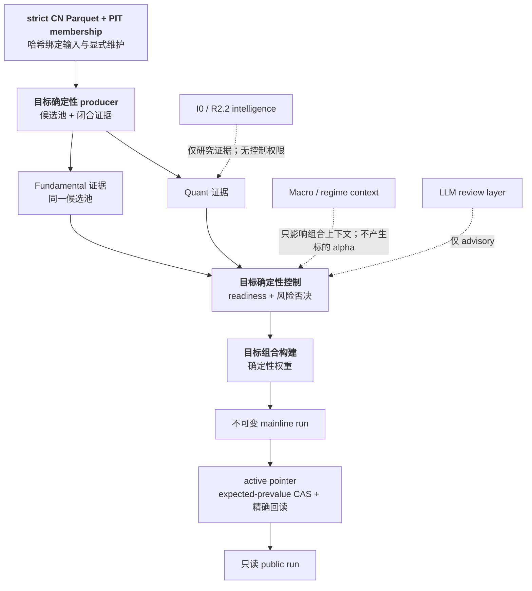

<div align="center">


**一套 fail-closed、公开主线仅支持 V17 的 A 股研究系统。**

*证据采用内容寻址，研究与权威彼此隔离；结果缺失时，系统不会编造替代品。*

[](https://www.python.org)
[](pyproject.toml)
[](LICENSE)

[English](README.md) · **简体中文**

[项目目的](#项目目的) · [当前运行面](#当前运行面) · [研究智能](#研究智能) · [治理目标](#治理目标) · [快速开始](#快速开始) · [当前边界](#当前边界)

</div>

---

## 项目目的

Quant-Investor 是一个面向中国 A 股的研究仓库，核心规则很简单：每个公开结论都
必须能追溯到精确证据；缺少权威时必须 fail closed。

仓库中存在几条刻意隔离的链路：

- 严格的市场数据维护与 point-in-time 输入；
- Factor Governance 与 research-only 前瞻证据；
- I0 Investment Intelligence 库和 R2.2 前瞻评估器；
- V17 v4 active-pointer 合约，以及只读的 Python、CLI、Web 和 Dashboard 消费者；
- 为兼容而保留、但位于 V17 权威之外的独立 legacy automation。

这些链路可以共享代码和证据格式，但不会彼此静默授予生产或组合权威。

## 当前运行面

目前已实现的 V17 公开流程是读取器，不是决策运行生成器：

```text
results/v17_mainline/strategies/<strategy-id>/_active.json
  -> 校验精确 active pointer
  -> 校验精确 immutable run 及其传递闭包
  -> 投影 myquant.v17.v4.mainline-public-run.v1
  -> 通过 Python、CLI、Web 或 Dashboard 返回同一份只读公开结果
```

所有公开读取面只解析一个精确指针。它们不会扫描最新运行、用 Shadow session
替代、自动创建权威文件，也不会回退到其他协议。

| 情况 | 结果 | 写入 |
|---|---|---:|
| Active pointer 缺失 | `V17_MAINLINE_UNINITIALIZED` | 0 |
| Pointer、run 或闭包无效 | `V17_MAINLINE_BLOCKED:<blocker>` | 0 |
| 公开请求不是 CN | `V17_MARKET_UNSUPPORTED` | 0 |
| 请求主线回测 | `V17_BACKTEST_UNAVAILABLE` | 0 |

所有公开结果读取面都只有读权限。`v17_mainline` 包同时公开了 low-level
exact-once 和 compare-and-swap 存储原语，但这些原语不是受治理的生产 publisher、
activation workflow 或 production authority。本仓库目前没有公开的生产 publisher
或 activation 命令。

这条边界专门防止四类常见失败：

| 失败方式 | 从系统内部看到的样子 |
|---|---|
| **扛不住自己窗口的证据** | 短窗口因子因重叠前瞻标签而显得显著，换到更长尺度后快速衰减。 |
| **会自我替换的数据** | 缺失的 Parquet 被 CSV、陈旧或推断数据替代，却不披露结果究竟由哪些字节产生。 |
| **会漂移的定义** | 因子的参考生产集变化后，定义含义随之变化，旧证据不再描述当前定义。 |
| **握有决策权的语言模型** | 模型生成的权重进入控制路径后，“为什么是这个仓位”失去确定性答案。 |

> **每一个数字都必须携带可复现的生成证据。证据缺失等于拒绝，而不是默认值。**

## 研究智能

V17 研究分为 observation 链和离线 intelligence 链：

```text
显式 V4 Forward request
  -> research-only Shadow observation 与精确来源闭包
  -> I0 Evidence records
  -> Bayesian 诊断 + 三层因果 Regime + branch Fusion
  -> 可证伪 Hypothesis + 不可变 Memory value
  -> 精确 R2.2 evaluation request
  -> stdout-only evaluation envelope + Memory Append Proposal
```

### I0 Markov regime

Markov 没有消失。当前实现刻意比旧生产 overlay 更窄：

- 三个彼此独立的层级：Market、Industry、Theme；
- 从显式、内容寻址的 `RegimeInput` 开始，只做一次 forward filter step；
- source refs 必须属于 observation 已验证的递归闭包；
- 不做 backward smoothing、拟合、隐式历史查找或持久化写入；
- 不具备仓位上限、risk overlay、portfolio、selector、broker、order 或 trade 权限。

R2.2 计算 regime-conditioned 研究指标时，只消费每一层已经选中的 state。它不把
posterior map 作为聚合输入，也不更新 Markov 模型。

### 尚未自动化的部分

I0 和 R2.2 是库加显式 CLI 命令。当前没有 V17 research-intelligence scheduler、
daemon、daily request generator、Memory CAS writer 或 paper-portfolio adapter。
缺少可选 Regime binding 时结果为 unavailable；提供了无效 binding 时整次评估阻断。

仓库也包含 `quant_investor/automation/` 下恢复的独立自动化模块。它是一条不完整
的 legacy 链，没有 V17 公开入口，且缺少部分 lazy runtime 依赖。它不是 I0/R2.2
日度循环，也不能创建主线权威。

## 治理目标

目标 producer 拓扑仍有治理价值，但不能与当前公开命令的实现混为一谈。下图节点是
目标职责；图中出现某个节点，不代表当前已经存在已注册的端到端 producer。



未来 producer 必须闭合所有输入和输出引用，把 advisory 模型输出留在确定性控制
之外，持久化不可变 run，并且只能通过 expected-prevalue CAS 加精确回读推进策略
指针。合并或部署代码永远不等于 activation。

## 因子治理

Factor Governance v4 把因子研究与 activation 隔离。其证据面覆盖数据安全、覆盖率、
RankIC/IC、分组收益、成本与换手、中性化、purged 样本外稳健性、组合增量、
trial correction、family-level 多重性校正和成熟度检查。

Ready 状态必须在运行时从精确的当前 artifacts 解析。本 README 不固定容易漂移的
候选数量、交易日数量或 ready 值。除非另一个受治理的 activation 合约已满足，
挖掘和诊断证据都保持 report-only。

## 快速开始

```bash
uv sync
cp .env.example .env
```

本地验证默认离线。只有得到明确授权的维护工作流才填写所需凭据。

以下三个兼容命令读取同一个 V17 active pointer：

```bash
quant-investor research run --workspace-root /absolute/path/to/myQuant --strategy-id <strategy-id>
quant-investor market analyze --workspace-root /absolute/path/to/myQuant --strategy-id <strategy-id>
quant-investor market run --workspace-root /absolute/path/to/myQuant --strategy-id <strategy-id>
```

市场维护是独立工作流；只有操作者明确授权时才可以调用外部 provider：

```bash
quant-investor market maintain --market CN --staged
quant-investor market storage-validate --market CN
```

从精确请求生成 research-only V4 Forward observation：

```bash
quant-investor-v17-v4 run-forward \
  --workspace-root /absolute/path/to/myQuant \
  --request-path <request.json> \
  --request-sha256 <sha256>
```

使用 R2.2 评估已经成熟的证据：

```bash
quant-investor-v17-v4 research-evaluate \
  --workspace-root /absolute/path/to/myQuant \
  --request-path data/private/research_intelligence/evaluation_requests/forward-evaluation-request-<sha256>.json \
  --request-sha256 <sha256>
```

评估器不写结果文件，只向 stdout 输出一行 canonical JSON envelope；Memory 持久化
仍是调用方单独负责的 CAS 操作。

## 当前边界

- 唯一支持的公开决策协议是 `myquant.v17.v4`，且仅支持 CN。
- 公开命令都是 active-pointer 的只读消费者。
- 没有公开的主线 publisher、activation CLI 或主线回测。
- Shadow、I0 和 R2.2 都是 research-only，不具备 broker、execution、order 或
  trade 权限。
- Markov 以三层、单步、因果 research filter 的形式存在；没有生产 Markov 环境
  开关，也没有持久化 risk overlay。
- 没有自动 paper-portfolio 或 Investment Memory writer。
- 独立 legacy automation 不是 V17 权威面。

## 项目地图

```text
quant_investor/
  automation/                独立但不完整的 legacy automation
  cli/                       公开命令路由
  data/                      数据 provider 与 universe helper
  factors/                   Factor Governance 与研究证据
  intelligence/              I0 与 R2.2 离线评估器
  macro/                     source-bound 宏观 observation helper
  market/                    市场维护与 canonical 读取
  pipeline/                  只读 V17 公开 Python facade
  v17_mainline/              active-pointer 校验与公开投影
  v17_v3_contract/           历史兼容 validator 与 resources
  v17_v4_contract/           V17 v4 schema 与 validator
  v17_v4_runtime/            research-only Forward/Shadow runtime
portfolio_dashboard/         只读 V17 DTO consumer
web/                         本地 API；V17 research 路由只读
docs/                        架构、runbook 与 review
```

## 开发

Python 3.13+。先运行最窄的相关测试；涉及共享面的广泛变更运行：

```bash
PYTHON=./.venv/bin/python scripts/staged_upgrade_quality_gate.sh
```

除非任务明确授权，本地验证不得调用 live data、LLM、broker、order、execution 或
trade API。

## 文档

- [文档索引](docs/README.md)
- [V17 v4 主线合约](docs/architecture/v17_v4_production_research_contract.md)
- [入口与版本](docs/architecture/entrypoints_and_versioning.md)
- [Forward evidence runtime](docs/architecture/v17_v4_forward_evidence_runtime.md)
- [Investment Intelligence I0](docs/architecture/v17_i0_investment_intelligence.md)
- [Forward Research Evaluator R2.2](docs/architecture/v17_r22_forward_research_evaluator.md)
- [Factor Governance v4](docs/factor_governance_v4.md)
- [因子挖掘机制](docs/factor_mining_mechanism.md)
- [V17 v4 运维](docs/runbooks/v17_v4_operations.md)
- [Legacy 配置清理](docs/runbooks/v17_legacy_configuration_cleanup.md)
- [模块地图](docs/modules/module_map.md)
- [Agent 指南](AGENTS.md)

## License

[MIT](LICENSE) © 2024 alpha-mw
