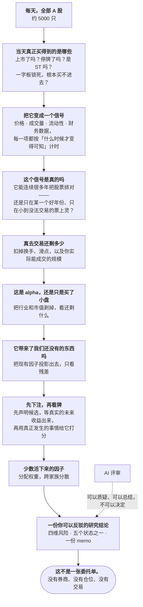

<div align="center">


**一个为「拒绝」而建的 A 股研究系统。**

*大多数量化平台在优化「怎么找到信号」。这个系统在优化「怎么否掉信号」。
在 A 股，后者才是稀缺的那一半能力，也是决定研究能不能扛住真实市场的那一半。*

[](https://www.python.org)
[](pyproject.toml)
[](LICENSE)

[English](README.md) · **简体中文**

[问题](#问题) · [主张](#主张) · [我们建了什么](#我们建了什么) ·
[漏斗](#它是怎么研究-a-股的) · [为什么不一样](#为什么不一样) ·
[目前的证据](#目前的证据) · [现状](#现状)

</div>

---

## 问题

A 股因子研究面对的是「过剩」，不是「稀缺」。几百个看起来说得通的信号，一个上午就能造出来。
几乎没有人拥有的，是一套能站得住脚的办法，去判断这些信号里哪些扛得住真实市场。

而所谓真实市场，同时意味着五件事：会被事后追溯调整的财务数据；在你的回测里被愉快买卖、
但当天其实停牌或一字板的股票；互相重叠、并因此抬高一切显著性检验的收益窗口；一个「你找得
越用力、最好的结果看上去就越好」的搜索过程；以及一份通常只是「同一个想法换了两百组参数」
的候选清单。

这些都不会报错。它们只会返回一个完全合理的数字。整个行业的通病不是崩溃，而是——回测好看，
然后安静地亏钱。

## 主张

**量化的瓶颈在裁决，不在生成。**

因子研究里每一个真正严重的误差来源，本质上都是某种「不小心看到了未来」。每一种在文献里都有
公认的修正方法。而这些修正无一例外：算起来贵、做起来不出彩、跳过去毫不费力——所以几乎所有
人都跳过了，而且跳过这件事在结果里完全看不出来。

一个默认就跑这些修正、并且在跑不动时拒绝给结论的系统，比一个更快给出结论的系统更值钱。

> 所以交付物不是净值曲线，而是一个附带证据的裁决——或者一次明确的、指名道姓的拒绝。

## 我们建了什么

| 支柱 | 是什么 | 为什么重要 |
|---|---|---|
| **一份不会在时间上撒谎的市场记录** | 每一个价格、财务数据和指数成分，都与「它真正变得可知的日期」一起存储，同时带上停牌、涨跌停与 ST 状态 | 从源头消除前视与幸存者偏差，而不是指望每个研究员自己记得 |
| **一台裁决引擎** | 八项彼此独立的准入检验，从「这在当天可知吗」一路到成本、容量、中性化和组合贡献 | 一个因子必须回答全部八项；缺证据算失败，永远不算通过 |
| **默认开启的诚实统计** | 修正收益窗口的重叠、修正搜索本身的代价、修正「大多数候选其实是同一个候选」 | 这是几乎所有项目都省掉的一层，也是最经常改变结论的一层 |
| **一套预注册协议** | 候选必须在结果存在**之前**声明并密封；历史回测可以支持一个论证，但永远不能了结它 | 让事后诸葛亮在结构上不可能，而不只是「不提倡」 |
| **一个人能反驳的决策层** | 四个维度的风险评估、五个显式研究状态之一，以及一份只能引用已验证证据的 memo | 把一个数字变成可复核的投资论证——并且到此为止，不越过成为交易的那条线 |

包裹着这一切的是一条规矩：**AI 负责评审，确定性逻辑负责决定。** 模型可以总结证据、挑战结论、
起草假设；但它不能设定任何一个分数、阈值、权重或决策。"为什么是这个仓位"永远有一个机械的答案。

## 它是怎么研究 A 股的

一个漏斗。从全部 A 股开始，每一步扔掉说不清楚的那部分。绝大多数都会被扔掉——这是设计在生效。



关于这个形状，有两点比其中任何单独一步都重要。

**最窄的地方在中间。** 大多数项目把力气花在顶端——更多数据、更多候选——和底端的更好优化器上。
这个项目把力气花在中间那四个问题上，因为一个「看上去合理的数字」正是在那里变成一个错的。

**最后那根箭头是一堵墙。** 走完漏斗产出的是研究结论，不是仓位。把研究变成真实组合是一个
**刻意没有建**的独立步骤，所以这里没有任何东西能悄悄地从「有意思」毕业成「已成交」。

## 为什么不一样

Qlib、backtrader、vectorbt、zipline 在回答*「这样做过去能赚多少」*上非常出色。这个系统是为
*「我该不该相信它」*而建的——这两个问题需要**相反的默认值**。

| | 回测优先的平台 | 这个系统 |
|---|---|---|
| 交付物 | 净值曲线 + 因子排行 | 一个附带证据的裁决，或一次指名道姓的拒绝 |
| 证据缺失时 | 填默认值、告警、继续 | 停下。缺证据是失败，不是空缺 |
| 多重检验 | 有的话也是事后补的 | 候选必须跨过的一道准入栏 |
| 一次回测能证明什么 | 一切——它**就是**决策 | 单独什么也证明不了。它能支持一个论证，不能了结它 |
| 搜索目标 | 最强的那个信号 | 对已持有的东西补充最多的那个信号 |
| 研究 → 生产 | 同一个脚本；回测好看就是决策 | 两套独立系统，而且中间那座桥刻意没建 |
| 负面结果 | 不发布 | 发布、标日期，并且留在这份 README 里 |

代价是显式的：**这个系统更慢地说「是」**，会挡下一个宽松流水线此刻已经在交易的因子。这个
不对称是选出来的。在一个「同样的重叠窗口错误会让本该通过三个的因子通过五个」的市场上，
昂贵的错误不是你错过的那一个。

## 目前的证据

一个研究系统能产出的最有价值的东西，是一个可信的否定结论——而这个系统已经产出了好几个，
对象都是它自己此前的工作。

- **已在生产中的五个因子里，有两个在收益窗口重叠被正确修正之后不再显著。** 而它们此前
  通过了这个系统当时的每一项检验。
- **一次完整挖掘运行的 230 个候选中，零个跨过了「搜索代价」这道栏。** 选择过程本身是稳定的、
  没有在拟合噪声；只是效应量太小，撑不起这么宽的一次搜索。由此得出的结论是**把搜索收窄**，
  而不是加宽。
- **那次运行里得分最高的候选，结果是我们本来就已经持有的东西。** 把排序依据从「它单独看
  有多强」换成「它补充了多少」之后，它从第一名掉到了中游——并且顶上来一个真正不一样的候选。
- **一个本该是观测值、实际却是被重建出来的市值字段**，隐蔽了好几个月才被发现并移除。
  大约四分之一的取值受到影响。

在当前标准下，没有任何新因子是可准入的，而系统选择如实说出这一点，而不是去调低某个阈值。
这是预期行为，不是一份缺陷报告。

## 现状

仅 A 股。没有券商、报单、执行或交易权限——这是设计，不是遗漏。

**今天已经在跑的：** 点位市场记录；带统计修正的八项裁决引擎；预注册协议；研究决策层；
以及通过 Python、CLI 和 dashboard 的只读呈现。

**刻意没有建的：** 从研究通往真实组合的那座桥。也就是说，没有自动候选搜索、没有生产发布器、
没有调度器、没有模拟盘账本、没有券商连接。每一项都是需要受治理的一步，不应该意外出现；
而在裁决还没建完之前就去扩大搜索，只会制造出这个项目存在的理由——那个因子动物园。

## 运行

```bash
uv sync
cp .env.example .env
quant-investor --help
quant-investor-v17-v4 --help
```

本地工作默认离线。主要入口是：市场维护（`quant-investor market maintain`）、只读公开结果
（`quant-investor research run --strategy-id <id>`）、前瞻证据的采集与评估
（`quant-investor-v17-v4 research-evaluate`），以及组合准备度诊断
（`quant-investor portfolio cycle-status`）。每一个都要求显式输入，并且在缺东西时返回一个
具名状态，而不是拿一个替代结果顶上。

Python 3.13+。CI 的本地等价物：

```bash
uv run pytest tests/unit -q
uv run flake8 quant_investor --count --select=E9,F63,F7,F82 --show-source --statistics
uv run mypy quant_investor/factors --ignore-missing-imports
```

## 文档

先读 [因子挖掘机制](docs/factor_mining_mechanism.md)——上面大部分设计决策背后的诊断都在
那里，它是一份研究笔记，不是一本手册。

- [文档索引](docs/README.md)
- [Factor Governance v4](docs/factor_governance_v4.md) —— 八项检验、成熟度与多重性
- [研究管线与协议](docs/architecture/research_pipeline_and_protocols.md)
- [V17 v4 主线契约](docs/architecture/v17_v4_production_research_contract.md)
- [I0 投资智能](docs/architecture/v17_i0_investment_intelligence.md)
- [R2.2 前瞻研究评估器](docs/architecture/v17_r22_forward_research_evaluator.md)
- [I1 投资决策智能](docs/architecture/v17_i1_investment_decision_intelligence.md)
- [组合周期基础](docs/architecture/v17_portfolio_cycle_foundation.md)
- [Tushare 数据清洗](docs/tushare_data_cleaning.md)
- [交易纪律](docs/trading_discipline.md)
- [V17 v4 运维](docs/runbooks/v17_v4_operations.md)
- [Agent 指南](AGENTS.md)

统计机制遵循标准文献而不是自创——Harvey、Liu 与 Zhu 的显著性门槛；Bailey 与 López de Prado
关于选择偏差与回测过拟合；针对重叠标签的组合式净化交叉验证；AlphaGen 与 AlphaForge 的
集合级目标。完整引用在上面那份挖掘笔记里。

## 许可证

[MIT](LICENSE) © 2024 alpha-mw
