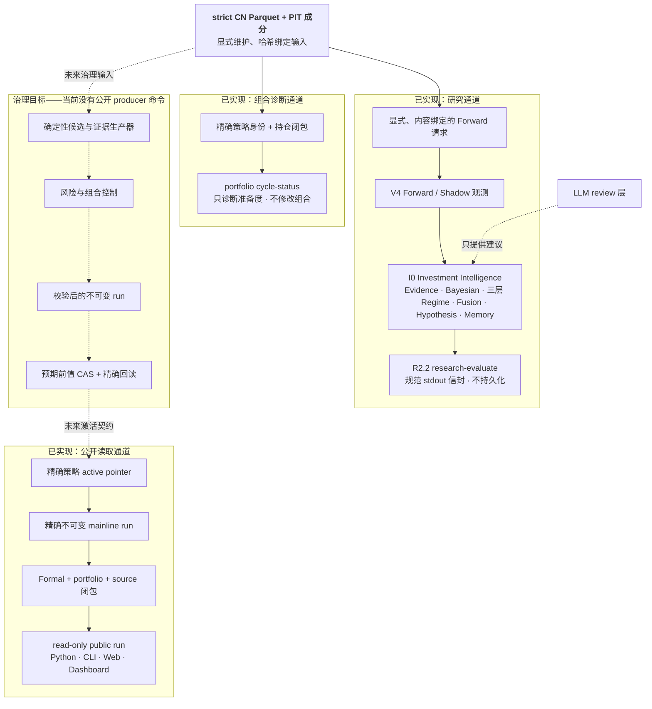

<div align="center">


**面向 A 股的量化研究与组合决策系统。**

*量化最难的不是生成信号，而是知道信号究竟意味着什么、由哪些证据支持，
以及系统应该在什么时候停下来。*

[](https://www.python.org)
[](pyproject.toml)
[](LICENSE)

[English](README.md) · **简体中文**

[设计主张](#设计主张) · [整体框架](#整体框架) · [运行方式](#运行方式) ·
[解决的问题](#解决的问题) · [真正特别之处](#真正特别之处) ·
[快速开始](#快速开始) · [当前状态](#当前状态)

</div>

---

## 这是什么

Quant-Investor 是一个面向中国 A 股的研究仓库，围绕唯一公开决策协议
`myquant.v17.v4` 组织。它把严格的 point-in-time 数据、因子研究、前瞻证据、
投资智能评估、组合准备度诊断和精确 active pointer 读取放在同一体系中。

这些能力刻意分开。研究结果不等于活跃组合；有效的不可变 run 只有被某个策略的
精确指针引用后才具有公开可见性；代码合并不等于业务激活；LLM 可以解释和质疑
证据，但不能选择候选、放松风险上限或修改权重。

仓库今天已经具备实际用途，但能力边界必须说清楚：它可以读取并校验已经激活的
V17 结果，可以累积 research-only 的 Forward 证据，可以评估精确的 I0/R2.2 请求，
也可以诊断组合决策输入是否齐备。当前仓库没有公开的决策 run 生产器、生产发布器、
激活命令、券商连接、下单路径或交易执行器。

## 设计主张

多数数量化系统不会以一个醒目的异常宣告失败。它们更常见的失败方式，是安静地返回
一个看起来合理的结果：

| 失败方式 | 在系统内部看起来像什么 |
|---|---|
| **证据无法穿越自己的窗口** | 因子在重叠前瞻标签上显著，换成非重叠或更长窗口后便消失。 |
| **数据悄悄替换自己** | 缺失的 Parquet 分区被 CSV、陈旧快照或推断值顶上，但标题结果看起来没有变化。 |
| **定义会漂移** | 因子依赖可变生产集，留存证据描述的已不是今天使用的同一个因子。 |
| **把研究当成权威** | Shadow 观测、诊断评分或模型叙述被误当成已经激活的组合结果。 |
| **语言模型进入控制路径** | 生成的解释变成生成的权重，于是“为什么是这个仓位”失去确定性答案。 |

系统的回答很直接：

> **每个公开结论都必须能解析到精确证据。必要证据或权威缺失时，系统返回明确状态，
> 不会在背后换用另一个结果。**

这条原则比模块清单更能解释整个架构。规范数据按内容绑定；研究与激活位于不同通道；
公开读取只解析一个精确指针；无效输入以 blocker 的形式继续可见，而不是被转换成
乐观默认值。

## 整体框架

当前仓库有三条已经实现的通道，以及一条明确标注的治理目标：



实线代表今天已经实现或可以调用的路径。虚线 producer 路径描述未来受治理 writer
必须满足的设计；它不是 `research run`、`market analyze` 或 `market run` 今天实际
执行的内容。

### 数据权威

规范市场数据是 strict CN Parquet、point-in-time 成分和哈希绑定 manifest。维护是
显式工作流。分析或读取命令不会为了补一个缺口而在后台启动 provider 调用，CSV 也
不会成为隐藏的运行时替代品。

### 公开权威

公开 V17 表面是一个精确读取器：

```text
策略 active pointer
  -> 不可变 mainline run
  -> formal / portfolio / source 闭包
  -> myquant.v17.v4.mainline-public-run.v1
```

读取器不会创建决策 run，不会扫描最新 artifact，不会选择另一套协议，不会借用
Shadow 结果，也不会创建占位指针。仓库包含底层不可变写入与 compare-and-swap
原语，但没有公开 production publisher 或 activation CLI。

### 投资智能研究

V4 Forward 与 Shadow 从精确、内容绑定的请求中积累只面向未来的证据。I0 在其上提供
确定性 Evidence、Bayesian 诊断、三个独立的因果 Regime 层、考虑可用性的 branch
Fusion、可证伪 Hypothesis 和不可变 Memory 值。

Regime 的固定层是 Market、Industry 和 Theme。每层只根据显式输入做一次向前
Markov filter；没有向后平滑、隐藏历史搜索、持久化 writer、仓位上限、风险 overlay
或组合修改。

R2.2 重放一个精确请求，并向 stdout 输出一个规范评估信封。它可以提出 Memory 后缀
提案，但不会写入该提案。当前仓库也没有 V17 投资智能 scheduler、daemon 或自动
paper-portfolio adapter。

### 因子治理

Factor Governance v4 把候选生成、闸门证据、试验修正、同族多重检验、成熟度和组合
增量视为不同问题。挖掘证据始终是研究证据，只有满足另一套受治理激活契约后才可能
进入生产状态。

准备度从精确的当前 artifact 解析。README 不固定容易过期的候选数量、session 数量
或 readiness 数值。机制与重构方案详见
[因子挖掘机制](docs/factor_mining_mechanism.md)。

### 组合准备度

`portfolio cycle-status` 校验显式提供的策略身份和持仓闭包，生成只读准备度文档。
它不会按目录时间猜测“当前持仓”，不会创建组合、写 paper ledger、激活策略或调用
券商。

## 运行方式

仓库提供多个拥有不同权限的独立工作流。

### 1. 维护规范市场数据

```bash
quant-investor market maintain --market CN --staged
quant-investor market storage-validate --market CN
```

Provider 访问与本地校验分开，只有在操作者明确授权时才可进行。一次 storage
validation 成功，只证明它实际执行的存储检查通过；它本身不会生成当前投资决策。

### 2. 读取已激活的 V17 结果

下面三条兼容命令解析同一个策略指针，并返回同一条只读权威链：

```bash
quant-investor research run \
  --workspace-root /absolute/path/to/myQuant \
  --strategy-id <strategy-id>

quant-investor market analyze \
  --workspace-root /absolute/path/to/myQuant \
  --strategy-id <strategy-id>

quant-investor market run \
  --workspace-root /absolute/path/to/myQuant \
  --strategy-id <strategy-id>
```

预期的明确状态包括：

| 情形 | 返回结果 | 写入数 |
|---|---|---:|
| Active pointer 不存在 | `V17_MAINLINE_UNINITIALIZED` | 0 |
| Pointer、run 或闭包无效 | `V17_MAINLINE_BLOCKED:<blocker>` | 0 |
| 市场不是 CN | `V17_MARKET_UNSUPPORTED` | 0 |
| 请求 mainline backtest | `V17_BACKTEST_UNAVAILABLE` | 0 |

这些状态说明缺失或不支持的具体内容，不代表可以扫描旧结果或返回替代品。

### 3. 累积 Forward / Shadow 证据

```bash
quant-investor-v17-v4 run-forward \
  --workspace-root /absolute/path/to/myQuant \
  --request-path data/private/v17_v4_runs/forward_requests/<request_id>.json \
  --request-sha256 <exact-byte-sha256>
```

完成的 Shadow session 仍然只属于研究通道。它不能推进 active pointer，也不能成为
公开组合结果。

### 4. 评估成熟研究证据

```bash
quant-investor-v17-v4 research-evaluate \
  --workspace-root /absolute/path/to/myQuant \
  --request-path data/private/research_intelligence/evaluation_requests/forward-evaluation-request-<sha256>.json \
  --request-sha256 <exact-byte-sha256>
```

该命令离线运行，只向 stdout 输出结果。它不会调用 provider 或模型，不会写结果、
追加 Memory、改变 Factor tier、选择组合或触碰 active pointer。

### 5. 诊断组合周期输入

```bash
quant-investor portfolio cycle-status --help
```

该诊断要求显式规范路径、精确 SHA-256 绑定和 decision cutoff。基础诊断为绿色，只
表示所提供的身份与持仓证据校验通过；完整业务组合周期仍可能尚未闭合。

## 解决的问题

| 经典问题 | 仓库如何处理 |
|---|---|
| **前视与幸存者偏差** | point-in-time 成分、显式 cutoff 和考虑 availability 的证据契约。 |
| **数据静默替换** | strict canonical Parquet、哈希绑定 manifest，不隐藏回退到 CSV 或最新文件。 |
| **公开权威含糊** | 一个精确策略指针只命名一个不可变 run 及其递归闭包。 |
| **把研究说成生产** | Forward、Shadow、I0/R2.2、Factor 诊断和公开 mainline 权威使用不同 schema 与存储族。 |
| **非因果 Regime 分析** | Market、Industry、Theme 各自只做一次显式向前 Markov 步骤，不做向后平滑或隐藏历史读取。 |
| **多重检验与因子冗余** | 试验修正、同族多重检验和增量价值证据是 Factor Governance 的一等问题。 |
| **模型输出变成决策** | LLM 只出建议；候选、限制和权重必须来自确定性控制。 |
| **把代码发布误当成业务激活** | merge/deploy 状态与 active pointer 状态分开检查和报告。 |
| **从旧文件推断组合输入** | 组合准备度接受显式身份与持仓引用，不按时间寻找“最新”。 |

## 真正特别之处

**仓库如实说明已经实现的内容。** 公开命令名称不代表 producer 已经运行。读取器、研究
评估器、诊断基础和未来治理目标被分别描述。

**证据携带自己的身份。** 重要 artifact 绑定协议、策略、cutoff、source refs 和
semantic hash。缺少闭包的合理数字不会被提升成公开结论。

**证据缺失保持可见。** 系统返回命名状态或 blocker，并且不写替代结果。这比一个笼统
的“成功/失败”更有运维价值，因为它说明究竟缺少哪一层权威。

**研究可以足够深入，但不会因此获得运维权限。** Bayesian 诊断、Markov Regime、
branch Fusion、Hypothesis 和 Memory 提案可以持续演进，同时仍无法激活组合。

**AI 负责解释，确定性契约负责决策。** 模型可以总结、质疑或起草 hypothesis，不能
修改精确证据闭包、候选集、风险策略、组合、指针或交易状态。

**组合准备度是一条链，不是一个布尔值。** 策略身份、持仓、规范数据、Factor 状态、
风险策略、组合策略、发布和激活互相独立；校验其中一项不会自动授予其他权限。

## 快速开始

```bash
uv sync
cp .env.example .env
```

本地校验默认离线。只填写某个已明确授权维护工作流真正需要的凭据。查看公开与研究
命令：

```bash
quant-investor --help
quant-investor-v17-v4 --help
```

## 当前状态

当前仓库仅支持 CN，没有券商、下单、执行或交易权限。

已经实现：

- 精确 active pointer 校验和 read-only public projection；
- Python、CLI、Web、Dashboard 对同一 V17 权威链的读取；
- 显式 V4 Forward / Shadow 观测；
- 确定性 I0 Investment Intelligence 与 R2.2 评估；
- Factor Governance 研究证据；
- 只读策略身份、持仓和准备度诊断；
- 显式市场维护与存储校验表面。

尚未作为公开运维工作流实现：

- 端到端全 A 决策 run 生产器；
- 受治理 production publisher 或操作者激活命令；
- 自动 I0/R2.2 日度 scheduler 或请求生成器；
- 完整组合周期生产器、paper ledger writer 或学习 orchestrator；
- 券商、下单、执行或交易集成。

这个区分是刻意的：仓库可以完整说明目标拓扑，但不会声称一个缺失的操作者工作流已经
存在。

## 项目地图

```text
quant_investor/
  cli/                       公开命令路由与组合诊断
  data/                      数据源与 point-in-time 加工
  market/                    CN 维护与规范读取
  factors/                   Factor Governance 与研究证据
  intelligence/              I0 与 R2.2 research-only 智能层
  portfolio_cycle/           身份、持仓和准备度基础
  v17_mainline/              active pointer 契约与 public run 读取器
  v17_v4_contract/           V17 v4 schema 与校验
  v17_v4_runtime/            Forward / Shadow 观测运行时
portfolio_dashboard/         只读 Dashboard 契约
web/                         本地研究工作台与 Web reader
results/v17_mainline/        活跃结果命名空间，仅在状态存在时出现
results/v17_v4_shadow/       research-only 前瞻证据命名空间
```

## 开发

Python 3.13+。先运行最小相关检查。大范围 staged-upgrade 工作使用：

```bash
PYTHON=./.venv/bin/python scripts/staged_upgrade_quality_gate.sh
```

除非任务明确授权，本地校验期间不要调用实时 Tushare、yfinance、LLM、券商、下单、
执行或交易 API。

## 文档

- [文档索引](docs/README.md)
- [研究链路与协议](docs/architecture/research_pipeline_and_protocols.md)
- [V17 v4 主线契约](docs/architecture/v17_v4_production_research_contract.md)
- [I0 Investment Intelligence](docs/architecture/v17_i0_investment_intelligence.md)
- [R2.2 Forward Research Evaluator](docs/architecture/v17_r22_forward_research_evaluator.md)
- [组合周期基础](docs/architecture/v17_portfolio_cycle_foundation.md)
- [Factor Governance v4](docs/factor_governance_v4.md)
- [因子挖掘机制](docs/factor_mining_mechanism.md)
- [V17 v4 运维](docs/runbooks/v17_v4_operations.md)
- [Agent 指南](AGENTS.md)

## 许可证

[MIT](LICENSE) © 2024 alpha-mw
