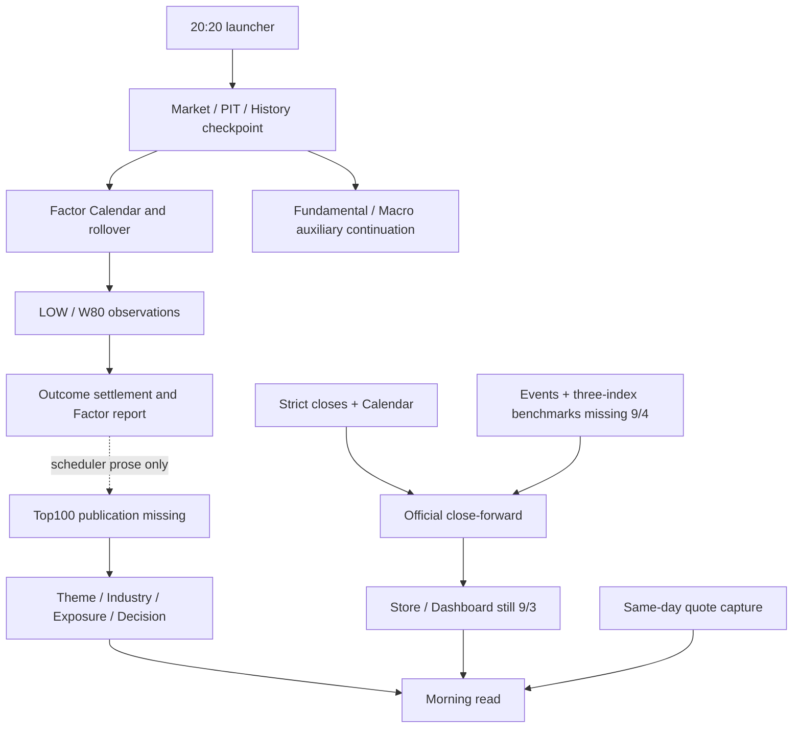

# Daily Evidence DAG: current inventory and P0 design

This inventory is diagnostic, not a production completion or activation receipt.
The full objective and acceptance sequence are in ../plans/daily_evidence_dag_p0.md.
Machine baseline: results/system/daily_dag_baseline.json, observed2026-09-07.

## Local source implementation, 2026-09-09

Source integration into `/Users/maxwell/mySpace/myQuant` is complete; this does not
mean deployment. The inventory and diagram below describe the September 7 baseline.
The local native DailyFactorLoop now connects Factor/observations to Top100 and the
daily DAG. The public `production daily-close` dispatcher also supports upstream
historical catch-up through the existing per-day execution path.

For `cn-daily-production-request.v1`, action `CATCH_UP` retains its existing 13
fields. `recipe_ref=null` selects the materialized-native-input path. A non-null
`recipe_ref` selects a canonical collection. The legacy collection has `schema_version` equal to
`cn-daily-catchup-recipes.v1` and `recipes`, a map from covered trade dates to execute
recipe templates. Templates use the existing recipe v1/v2 fields, with
`previous_completion_ref`, `bootstrap_ref`, and
`store_preimages.store_pointer_ref` explicitly null. All other policies, sources,
Event and benchmark preimages remain explicit inputs. Template dates and
`day_input_refs` must be disjoint, covered by the supplied native Calendar, and
historical relative to both Calendar observation and actual runtime.

The controller replays each preceding EOD and derives the next recipe's predecessor
and Store preimage SHA from that EOD's immutable Store output. Generated recipe,
request and binding are written immutably under
`results/operations/daily_production/CN/<day>/catchup/<root-request-SHA>/` as
`recipe.json`, `request.json`, and `binding.v1.json`. Interrupted writes reconstruct
the same bytes; conflicts stop execution. Generated request v2 is private to this
controller and cannot execute directly through the public interface.

Historical handoff v3 retains `catchup_binding_ref` as well as
`historical_session_ref`. Current and archived readers replay the derivation and
original Calendar/raw refs; backfilled results remain retrospective. Completed days
are replayed without writers, missing day ownership blocks new work, and the first
incomplete execution stops successors while preserving the completed prefix.

Focused public/recovery checks pass. Installed full-DAG acceptance remains pending;
older synthetic five-day evidence does not certify these new integration changes.

## Mixed-date catch-up routing, 2026-09-13

The same CATCH_UP entry now accepts `cn-daily-catchup-recipes.v2` with exactly
`schema_version`, `recipes`, and `publication_policy`. New templates require
execute-recipe v4. `HISTORICAL_ONLY` captures dated history for every day;
`CURRENT_OBSERVED_CLOSE_ONLY` allows current publication only when the target is
also the Calendar's observed date and authorized close. Friday on a weekend
remains historical. Dates before observation use historical maintenance/request
v2; the observed close uses ordinary current maintenance/request v1, even when
its Dashboard scope is historical-only.

The copied recipe's Dashboard flag is derived before hashing. Binding v2 adds
maintenance mode, Dashboard mode and publication policy at fixed `binding.v2.json`.
Current execution passes no historical binding into native maintenance. Both its
fresh Calendar and finalized readback must prove the exact preceding open session
before business writes or callbacks. Existing templates, materialized inputs and
old claims are never rewritten to change scope.

Completed intermediate days require full native EOD replay, exact retained native
inputs and their own Calendar/predecessor continuity. They can then be consumed
as history without renewing expired current publication. Only the exact current
target invokes current serving gates; its publication failure keeps the batch
incomplete. Supplied unfinished inputs must already be native v5 with the derived
mode and fixed publication policy.

Automatic callers may now use `cn-daily-automatic-request.v1` through the same
`production daily-close` command. It accepts PLAN/CATCH_UP, exact native Calendar
refs, a collection-v2 ref, disjoint native-input refs and an optional initial
completed seed. It accepts no caller target or predecessor. The validated
completed-head pair or explicit seed supplies a locator; only native Calendar
fixed completion paths can advance its contiguous completed prefix. Head/seed
conflicts and a completion beyond a gap stop before business writes.

The resolved request, range and modes are retained immutably under the automatic
run's exact-ref identity. PLAN writes nothing. Executions hold a nonblocking
automatic lock and an exact pending lease, then call the existing catch-up
controller. A completed repeat preserves bytes and timestamps. Current serving
failure stays incomplete even when the native EOD permits lease release. An
expired unstarted lease can close only after native/day locks prove the absence
of claims, attempts and producer evidence; an immutable EXPIRED_UNSTARTED record
precedes IDLE. Old modes and started work are never rewritten. Automatic-derived
requests and generated per-day requests are controller-private.

The public automatic result wraps the validated original production result and
its exact resolution ref. Known PLAN outcomes exit0/2, CATCH_UP keeps the nested
outcome's exit, and inconsistent/unknown wrappers exit3. Full Phase11 local
validation is382 checks; current installed/native DAG rollout remains separate.

## Scheduled launcher integration, 2026-09-13

The existing `scripts/operations/run_cn_daily_slot.sh` has a mutually exclusive
logical2020 DAG profile. It accepts a workspace-relative exact automatic request
and release-install input with their SHAs, plus the absolute release repository.
Its run root must match the fixed native maintenance root. Legacy maintenance
and Factor-context invocations keep their original order until explicit cutover.

Installed inspection distinguishes COMPLETE_READ_ONLY, LOCAL_REPAIR and
PRODUCER_REQUIRED. Its exact saved stdout SHA is validated by the installed
reader, which repeats native inspection before the shell branches. Complete
work emits the verified NO_ACTION result without credentials or publisher calls;
local repair removes inherited credentials and uses the installed launcher's
explicit recover mode. Automatic requests retain the existing `production
daily-close --no-producers` restriction, confined to automatic CATCH_UP and
already sealed EOD metadata/publication repair. Bootstrap inspection v2 additionally
binds the target date and recovery scope: NONE, SERVING_ONLY or
COMMITTED_DAG_RECOVERY. The latter permits only cutoff-committed object repair and
governed downstream Research/Decision/Corporate/Store/Dashboard execution; it cannot
invoke upstream maintenance, providers, Factor rollover, Theme acquisition or
select a new cutoff/Store plan. Public --no-producers is not widened. Only actual
missing production reaches PROJECT_ENV.
Expired current publication remains blocked and cannot renew freshness.

The DAG branch cannot fall through into legacy Factor recovery, transient-veto
recovery or direct maintenance. It retains native STARTED/ENDED, inspection and
daily-close logs, and propagates truthful0/2/3 exits; missing ENDED persistence is
failure. Internal inspection10/11 codes are not public task outcomes. Part A has
330 local checks; daily input provisioning, first native EOD seed, matching
installation and live scheduler migration/readback remain Part B requirements.

The exact v5 bootstrap profile now uses the same launcher. Completed and retained
handoff/cutoff checks precede mutable baseline checks. Original transport refs are
bound byte-for-byte to deterministic retained request/recipe paths; no extra launch
binding is invented. Bootstrap dispatch holds the existing nonblocking automatic
strategy lock, and committed recovery rechecks inputs under the day lock. Native
confirmed closed-session evidence can return a credential-free no-session result.
Local validation is recorded in phase12-bootstrap-launcher-validation.json;
actual installed bootstrap remains required.

The package-only daily_prepare entrypoint now binds a reusable exact config and
native Calendar pair to immutable launcher inputs. It registers existing bootstrap
EXECUTE or automatic CATCH_UP requests under the Calendar date/config SHA, with a
commitment before generated objects and the request last. Existing commitments
can repair missing objects across midnight without selecting current heads again.
Fresh input preparation checks native Store/Event/benchmark date coverage and
explicit prediction deadlines; a same-day head/seed produces an empty automatic
collection. REGISTERED_INPUTS_ONLY conveys no native execution/EOD admission.
The existing launcher remains the next gate. Local196-check evidence is in
phase12-daily-preparation-validation.json.

The native daily Event command now accepts exact Calendar/raw input before
maintenance, owns the Record operation lock, and permits new standing-policy
closure only for the current OPEN day after15:30. Its source validator also serves
Corporate/cutoff/preparation readers; historical PARTIAL attempts retain their
status and do not depend on a later mutable veto file. Benchmark capture now lives
in the installed package, retains exact wire evidence and its original parent
pointer, and reconstructs only the exact committed candidate on retry. Native
pointer and compatibility projection publication share the existing benchmark
lock. These producer changes passed256 related local tests; receipt is
phase12-native-source-producers-validation.json.

The configured2020 launcher now calls the fixed installed daily_sources operation,
using two-stage source request locators and exact immutable history under the
existing automatic lock. It records PREPARING_SOURCES before source CAS, consumes
at most two native Calendar attempts per date/config, and upgrades the locator
before publishing request objects. It resumes exact pending/committed work and
passes the validated request to the existing daily-launch path. Only acquisition
and DAG producer branches receive credentials; one invocation reuses its single
PROJECT_ENV preflight. Cross-day source recovery cannot backdate uncommitted
CURRENT research. Local290-test evidence is in phase12-configured-launcher-validation.json.
Actual source config installation, genuine bootstrap/automatic seed transition,
current-source release installation, scheduler cutover and independent unattended
readback remain required.

## Verified break diagnosis

The deployed7b26ac2 DailyFactorLoop.core_completed invokes core replay, predecessor
observation recovery, Calendar capture/replay, factor rollover, observation registration,
settlement, then report. Neither this handler nor its terminal report invokes pool
publication. The live20:20 prompt still delegates Top100 to a later LLM-managed step.
Classification: ORCHESTRATOR_MISSING / missing native downstream trigger. There is no
Top100 attempt receipt establishing a command/provider failure for9/4.

Current exact baseline: Market/PIT and Factor20260904; LOW/W80 OPEN registered9/6;
Top1009/4 absent; Store and Dashboard valuation9/3. The registered Event Store dates
stop9/3 and the benchmark generation ends9/3. Store9/4 has INPUT_MISSING event and
benchmark prerequisites, not a Factor computation failure. No missing event is
inferred CLOSED_EMPTY; no actual holdings change is performed by this project.

## Existing node contracts

| Node | Command / callable | Inputs | Output / selected authority | Idempotency | Verification | Completion meaning | Consumers |
|---|---|---|---|---|---|---|---|
| calendar | system calendar-capture; trusted provider validator | registered capture + release + custody | compiled calendar/capture-success; Factor generation calendar refs | exact capture no-replace; conflict closed | published capture-root validator | COMPLETE; DEGRADED authority disclosed | market,factor,store |
| market | market daily-maintain | scope + PIT + provider/History exact refs | immutable strict snapshot; data/parquet/cn/_latest.json | existing task claim/CAS and exact receipts | daily maintenance receipt validator | factor_input_readiness READY | factor,store |
| pit | market daily-maintain PIT component | registered full-A + capture + scope transition | membership Parquet/generation; data/parquet/cn/reference/stock_basic_membership_latest.json | generation SHA + guarded pointer | PIT source/lineage validator | no core coverage blocker | market,factor |
| factor | factor production-rollover | maintenance core + Calendar + current pointer | production generation + sealed signals; results/factors/_active.json | current-pointer CAS; equal inputs NO_ACTION | factor production-verify | VERIFIED/ACTIVE/READY | low_observation,w80_observation |
| low_observation | factor production-observe | exact sealed LOW and generation/source refs | OPEN NON_AUTHORIZING observation; results/factors/observations/YYYY/MM/DD/LOW.json | write once; existing exact readback | validate_factor_production_observation | OPEN; timing independently classified | top100 |
| w80_observation | factor production-observe | exact sealed W80 and generation/source refs | OPEN NON_AUTHORIZING observation; results/factors/observations/YYYY/MM/DD/W80.json | write once; existing exact readback | validate_factor_production_observation | OPEN; timing independently classified | top100 |
| top100 | research pool-publish | exact Factor/LOW/W80 + approved v2 policy | rank, selected_symbols, manifest, publish_receipt; results/intelligence/research_pool/aggressive_tech_manufacturing/YYYY-MM-DD | atomic no-replace; exact NO_ACTION | DailyResearchPoolStore exact leaf validation | PUBLISHED/NO_ACTION after validation | theme,industry,exposure,decision |
| theme | scripts/operations/run_cn_theme_replay.py | exact Top100 keyset + v2 policy + DC capture + registered TDX fallback | source-bound membership replay; data/private/intelligence_sources/theme/replays deterministic receipt | exact existing root replay; conflict closed | registered DC/TDX projection validation | COMPLETE membership or explicit missing; no inferred exposure | decision |
| industry | project_tushare_industry_source via compile-daily | SW2021 exact taxonomy/membership plans/captures | Industry source projection; explicit compilation request source ref | pure exact source replay | registered Industry projector | AVAILABLE/UNMAPPED/AMBIGUOUS | decision |
| exposure | daily_evidence source-bound company producer | annual/interim/company quantitative source evidence | HIGH/MEDIUM/LOW/UNVERIFIED economic exposure; exact company evidence references | pure source replay; no membership inference | registered company-evidence validation | valid evidence or explicit UNVERIFIED; not fabricated revenue | decision |
| fundamental | compile-daily binding; existing Fundamental component | registered binding-aware PIT generation and decision cutoff | Fundamental component evidence; data/parquet/cn/_fundamental_latest.json | exact accepted generation; no staging fallback | binding-aware Gate2/evidence validation | valid cutoff; lag disclosed; missing critical evidence blocked | decision |
| macro | existing Macro component/readiness closure | source release/observations + journal + cutoff | Macro evidence/readiness binding; data/parquet/cn/macro_observations/_latest.json | existing typed transaction; no veto deletion | registered readiness closure replay | CANONICAL_MACRO_READY is not economic risk approval | decision |
| corporate_action_recon | existing event store + research-risk adapter | exact owner events and source-bound corporate actions | shares/cost lifecycle proof; non-executable threshold on gaps; selected event generation and policy/ledger refs | read-only validation here; no actual position adjustment | registered event/lifecycle validation | RECONCILED or explicit UNRECONCILED | store,threshold_review |
| decision | research compile-daily | Factor/rank + Industry/Theme/company evidence + Macro/portfolio context | five-state research decision/evaluation/bundle; explicit output refs; no System active writer | pure compile; DAG must seal exact output | registered intelligence validators | valid completed evidence, with admission status separate | dashboard,morning |
| store | manage_cn_strategy_records close-through-latest | Store preimage + strict closes + Calendar + events + 3-index benchmarks | official valuation/continuity/performance; results/strategy_records/CN/aggressive_tech_manufacturing/_record_store/current.v1.json | offline atomic batch; existing writer CAS | load_registered_catalog + Store verify | complete required open-date prefix | dashboard |
| dashboard | existing private exporter + checker | exact Store + Market + benchmark; add DAG research refs | private verified bundle/selector; portfolio_dashboard/private/generated/cn_aggressive_dashboard_selector.v2.json | last-good on failed checker; exact selected refs | scripts/check_cn_dashboard_export.py | matching completed close date; explicit research partial | morning |
| morning | research morning-strategy PREFLIGHT/SEAL | prior completed DAG + same-day sealed quote + owner policies | research-only morning receipt; results/operations/morning_strategy/CN/YYYYMMDD/0945-run.v1.json | exact immutable SEAL; no provider re-fetch | morning validators + new read-only DAG consumer gate | MORNING_UPSTREAM_DAG_INCOMPLETE when required DAG absent | research review only |

## Baseline design decisions

The DAG joins financial and research completion while keeping their necessary
inputs separate: valid official-close accounting may proceed when research has
missing evidence; the full DAG remains PARTIAL/BLOCKED. The Morning consumer
requires the completed prior-session DAG, never maintenance or latest-directory
search. Day statuses are a projection over immutable node attempts and exact
source refs, not a new financial or System authority.

New Top100 publications use the registered `daily_research_tabular_pool_manifest`
and atomically seal five leaves, including `top100.parquet`, at the existing daily
pool path. The table preserves the native rank's exact order and decimal values;
its manifest binds the table SHA and original Factor/LOW/W80/Market/PIT/policy
evidence. The writer records actual first-publication time and retains it on
repeats. Historical four-JSON closures remain immutable and readable by their
original contract. New production explicitly requires the tabular format; it
cannot append a file to or upgrade an existing legacy directory.

The September 7 main checkout lacked the deployed DailyFactorLoop source. Local
source integration has since reconciled that split while preserving concurrent
weekly/Fundamental changes. Deployment is separate. The old automation/daily_runner
is not the intended stable production path.

## Default factor outcome admission

`factor production-settle` and the existing DailyFactorLoop now return
`factor-production-diagnostics.v2` for the current bounded cursor batch. Raw
horizon diagnostics remain available independently. The prior seal-only count is
named `component_sealed_by_close_count` and explicitly scoped to signal timing.
Old immutable classifications/outcomes are not relabeled or rewritten.

`oos_evidence` admits only an exact original observation bound to a fully replayed
contemporaneous, prospective, nonsynthetic, non-recomputed daily ledger. It groups
raw-close diagnostic metrics by factor and horizon, preserves unavailable values,
and never implies economic returns, trading authority or factor effectiveness.
Admission sources use existing content-addressed outcome-source storage. Stored
positive projections and summaries require the owning native readback again.

The evaluator reads the fixed completion path for the observation's signal date.
For v2 it uses the minted completed-handoff snapshot and archived install/claim
verifier. A matching active bridge invokes only completion replay; otherwise a
bounded isolated child uses that exact recorded interpreter and repository. There
is no script import fallback, latest-install selection or current-version retry.
Missing completion stays unconfirmed. Recorded v1 remains release-unbound legacy.
Invalid, late, synthetic and recomputed evidence contributes zero OOS samples.

This path exposed an old bridge that omitted Store-adoption/closure dependencies.
The current fixed module map now includes exactly those5 required module names;
native operations and all publication gates remain unchanged. The old installed
snapshot stays rejected by its own loader. Local validation does not replace final
current-source installed/full-DAG acceptance or prove real-time OOS observations.

## Validation targets

All10 reference integration cases plus five synthetic trading sessions, crash after
side effects before receipt, exact replay, SHA/Calendar/PIT/authority drift, stale
Dashboard, financial versus research failure isolation, immutable past-head reuse,
and conservative prospective timestamps. Synthetic runs are explicitly not real OOS
or proof of unattended scheduling. Full CI-equivalent gates follow integration.

## Current runtime wiring (observed, not target completion)

This graph shows two independent breaks. The new coordinator must persist
readiness and outcomes at both edges; it must not manufacture either input set.
