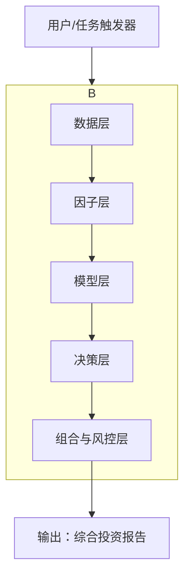

# V6.0 "大一统"版本 统一架构设计文档

## 1. 核心设计理念

V6.0 的核心目标是将 `quant-investor` 技能从V2.3到V5.0的所有核心能力，无缝地融合到一个统一、高效、可扩展的框架中。该框架将遵循您“数据驱动、人机结合、持续进化”的投资哲学，实现一个标准化的、端到端的投资分析流水线。

## 2. 统一框架分层架构 (Layered Architecture)

我们将采用分层架构，确保各模块职责清晰、低耦合、易于维护和升级。



### 2.1 数据层 (Data Layer)
- **职责**: 负责所有数据的获取、清洗、持久化和供给。
- **整合模块**:
    - **数据源**: 统一管理 V2.5/V2.6 的 Tushare, Akshare, yfinance, FRED 等客户端。
    - **持久化**: 强制集成 V2.7 的 `PersistentDataManager`，所有下载的数据（行情、财务、宏观）都将自动进行本地化和增量更新。
    - **数据获取**: 融合 V4.0 的 `DataProvider` 和 V4.1 的 `BenchmarkProvider`，提供统一的股票池（A股/美股指数成分）和市场基准数据接口。
    - **数据清洗**: 集成 V5.0 的 `DataCleaner`，对所有原始数据进行去极值、补缺失、标准化和复权处理。

### 2.2 因子层 (Factor Layer)
- **职责**: 负责所有因子的生成、计算、验证和筛选。
- **整合模块**:
    - **因子库**: 整合 V3.4 的 Alpha158 和 V5.0 的 500+ 因子库，形成一个庞大、高质量的基础因子池。
    - **因子挖掘**: 集成 V3.2 的遗传规划引擎和 V3.5 的深度特征合成引擎，实现自动化的新因子发现。
    - **因子验证**: 融合 V3.3 的 Tear Sheet 分析报告和 V4.1 的基准对比验证系统，确保所有因子都经过严格的Alpha和稳定性检验。

### 2.3 模型层 (Model Layer)
- **职责**: 负责使用机器学习模型对因子进行建模，生成初步的股票排序或预测信号。
- **整合模块**:
    - **ML模型**: 集成 V5.0 的 `QuantMLModels`，支持 XGBoost, LSTM, Transformer 等模型。
    - **训练框架**: 采用 V5.0 的时间序列交叉验证和自定义损失函数设计。
    - **信号生成**: 模型输出初步的预测信号，并筛选出Top N的备选股票池，传递给决策层。

### 2.4 决策层 (Decision Layer)
- **职责**: 对模型层筛选出的备选股票池进行深入的、多维度的定性分析，形成最终的投资决策。
- **整合模块**:
    - **多LLM适配器**: 强制集成 V3.6 的 `MultiLLMAdapter`，支持 OpenAI, Gemini, DeepSeek, Qwen, Kimi 等多种大模型，并从 `~/.quant_investor/credentials.env` 自动加载密钥。
    - **多Agent辩论**: 完整移植 V2.9 的多Agent辩论系统（财务、行业、护城河、估值、风险），对备选池中的每只股票进行深度分析和多空辩论。

### 2.5 组合与风控层 (Portfolio & Risk Layer)
- **职责**: 根据决策层的投资建议，构建最优投资组合，并进行全面的风险评估。
- **整合模块**:
    - **组合优化**: 整合 V5.0 的 `PortfolioOptimizer`，支持 Black-Litterman 等高级优化算法。
    - **风险管理**: 整合 V5.0 的 `AdvancedRiskManager`，实现 Barra 模型风险分解、GARCH 波动率预测和历史情景压力测试。

## 3. Master Pipeline V6.0

我们将创建一个全新的 `MasterPipelineV6` 类，它将作为整个技能的唯一入口，严格按照以下顺序调度和执行所有分层模块，实现端到端的自动化分析。

```python
class MasterPipelineV6:
    def __init__(self, market: str, stock_pool: list = None, llm_preference: list = None):
        # 初始化所有层
        self.data_layer = UnifiedDataLayer()
        self.factor_layer = UnifiedFactorLayer()
        self.model_layer = UnifiedModelLayer()
        self.decision_layer = UnifiedDecisionLayer(llm_preference)
        self.risk_layer = UnifiedRiskLayer()

    def run(self):
        # 1. 数据获取与准备
        raw_data = self.data_layer.get_data(market, stock_pool)
        # 2. 因子计算与筛选
        top_factors, candidate_stocks = self.factor_layer.process(raw_data)
        # 3. 机器学习建模
        ml_signals = self.model_layer.predict(top_factors, candidate_stocks)
        # 4. LLM深度定性分析
        investment_case = self.decision_layer.debate(ml_signals)
        # 5. 组合构建与风险评估
        final_portfolio, risk_report = self.risk_layer.build_and_assess(investment_case)
        # 6. 生成最终报告
        return self.generate_final_report(final_portfolio, risk_report)
```

## 4. 技能入口 (SKILL.md)

最终，`SKILL.md` 将被极大简化，只暴露一个核心入口，即调用 `MasterPipelineV6`。用户只需提供最简单的指令（如市场、持仓），即可触发整个复杂的分析流程。
